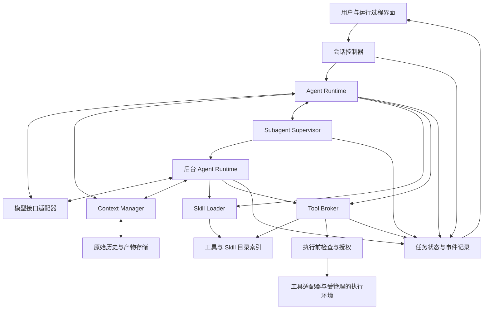
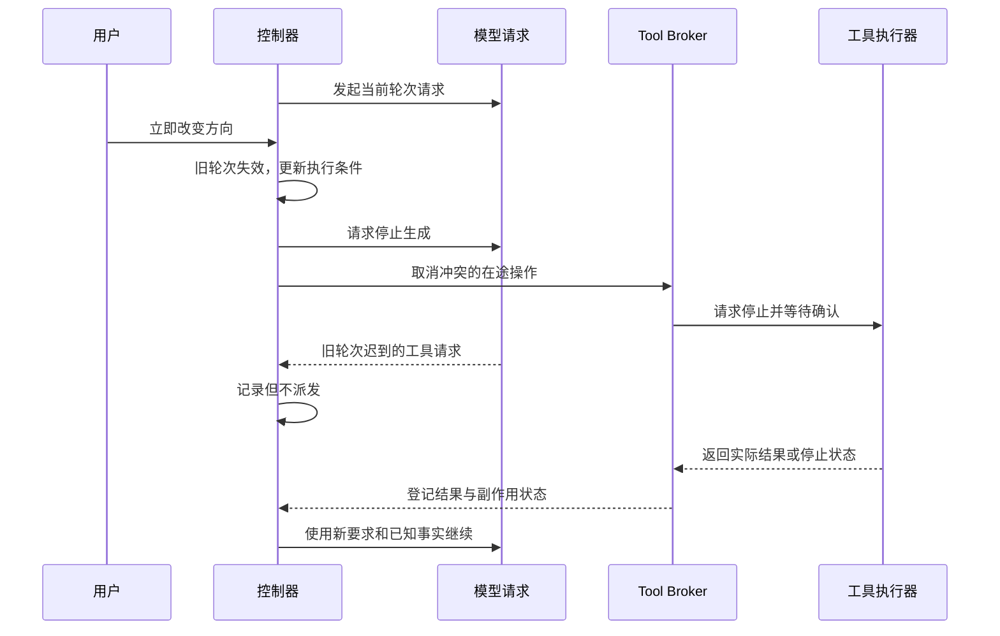
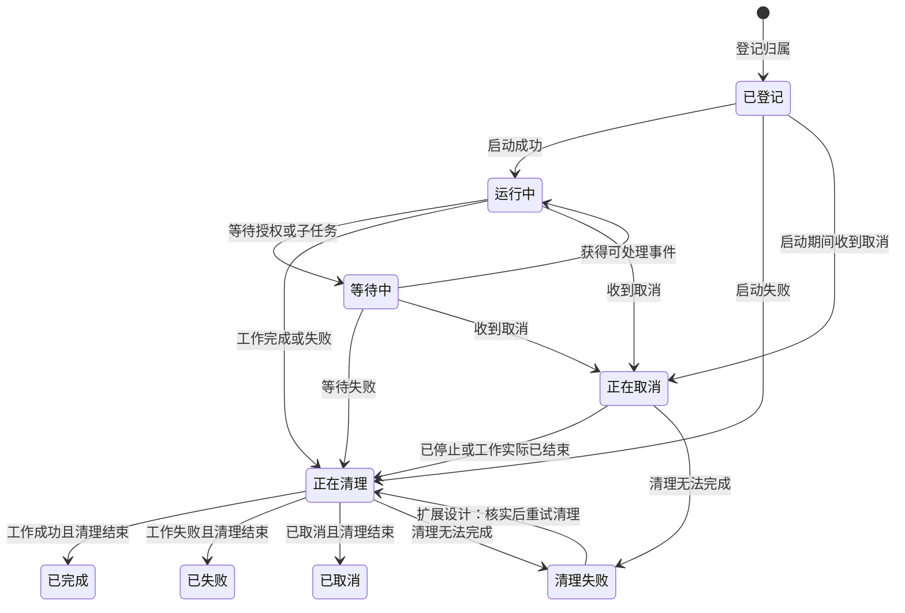
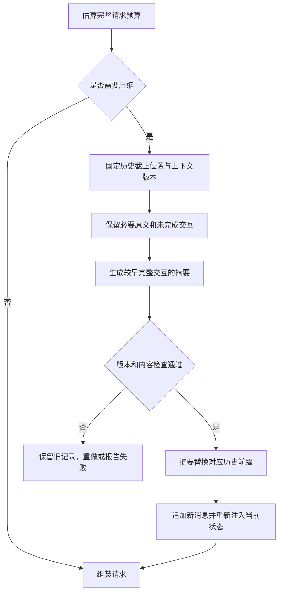
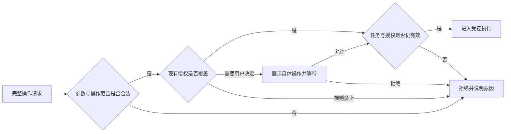

# 课程展示用 Agent Harness Framework 设计文档

本文面向负责 demo 实现和课程 PPT 制作的团队。设计围绕用户打断、后台 subagent、工具加载与分发、skill 加载和上下文压缩展开，并补充安全性、可靠性、趣味性三个方面的增强。

本文是设计方案，不是已实现能力或测试结果的报告。“基础实现”表示本次 demo 应做实的机制；“可选增强”表示基础闭环完成后再考虑；“扩展思路”用于解释当前边界，不列入本次实现承诺。文中的演示任务是讲解示例，不构成新增业务需求。

## 1. 项目目标与范围

### 1.1 我们要展示什么

本项目展示模型外部的 agent 运行框架：模型负责根据目标和上下文提出下一步行动，harness 负责管理执行、接收用户干预、协调后台任务、提供所需能力、维护上下文并约束权限。

“完整”指一次任务能够从接收请求走到执行、验证和结束，过程中发生打断、工具失败、后台结果返回或上下文不足时，都有明确的处理路径。课程 demo 优先展示机制完整、行为可解释和边界清楚，不追求生产系统的全部能力。

| 基础要求 | 本次设计的含义 |
| --- | --- |
| Code agent loop | 能围绕代码任务完成读取、分析、执行操作、检查结果和继续决策 |
| 用户打断 | 能补充信息、立即改变方向和停止任务，并处理旧输出与正在执行的操作 |
| 后台 subagent | 创建后主 agent 可以继续工作，同时保留管理、通信、取消和回收能力 |
| 工具加载与分发 | 从大目录中发现相关工具，按需加载定义并通过统一入口调用 |
| Skill 加载 | 从大目录中发现适用 skill，按需读取指令与资源，管理作用范围 |
| 上下文压缩 | 在预算内保留当前工作需要的信息，能够查回原始历史并继续执行 |

### 1.2 规模要求如何解释

本次同时考虑两类规模：支持 1000+ 种工具和 1000+ 个 skill 的目录及按需使用；支持任务累计 1000+ 次工具调用的运行机制。千级并发不属于本次目标，1000+ 个 skill 也不意味着将它们同时放入模型上下文。

目录容量、检索质量、真实集成数量、累计调用能力和并发能力分别验证。模拟工具可以验证分发、超时和调度，不能据此声称已经接入同等数量的真实服务；累计大量可控调用可以验证运行时，不能直接证明模型具有同等长度的自主任务能力。

### 1.3 实现边界

采用单机部署、一个后端内多个职责明确的模块。主 agent 与 subagent 共享能力目录，各自拥有工作上下文；工具执行进程由运行时管理。前端负责交互和运行过程展示，不拥有任务状态的最终解释权。

本次不实现跨机器调度、任意外部操作回滚、任意代码的断点续跑、无损长期记忆和完整的生产权限体系。具体模型、前端技术、索引实现和执行环境产品不在本文中固定；选型需要满足后文的机制要求。

## 2. 总体架构

### 2.1 模型与运行时的职责

模型决定如何分解任务、选择能力、理解结果和生成回答。运行时掌握任务是否有效、操作是否允许、资源是否仍存活等可由程序判定的事实。模型输出是行动请求，必须通过运行时检查才能成为实际执行。

主 agent 与 subagent 使用相同的 loop 抽象。两者的区别主要是任务归属、上下文、可用权限和工作目标，而不是两套独立执行体系。

### 2.2 模块职责

| 模块 | 主要职责 | 不应承担的职责 |
| --- | --- | --- |
| 会话控制器 | 接收用户消息、安排有效执行轮次、顺序处理状态变更 | 等待长工具执行而阻塞用户输入 |
| Agent Runtime | 组装一次决策、调用模型、请求执行工具、处理结果并继续 | 自行绕过授权启动资源 |
| Subagent Supervisor | 管理任务树、启动与关闭、结果投递、资源回收 | 代替模型判断业务结论 |
| Tool / Skill Registry | 保存目录、支持检索、解析来源和版本 | 将检索命中直接视为执行授权 |
| Tool Broker | 加载工具定义、校验参数、执行前检查、调用适配器、登记结果 | 对所有失败一律自动重试 |
| Skill Loader | 加载指令与资源、记录作用范围、避免重复注入 | 将 skill 的自然语言要求转成更高权限 |
| Context Manager | 预算管理、历史选择、压缩、原文检索和状态注入 | 用摘要替代真实授权和进程状态 |
| 执行环境 | 运行命令或脚本，提供可追踪的执行句柄及取消方式 | 仅凭设置工作目录就宣称安全隔离 |
| 事件与产物存储 | 保留执行经过、原始输出和产物引用，支持检查与展示 | 自动保证崩溃恢复或完整重放执行 |

### 2.3 三个生命周期

**会话**承载用户与系统的持续交互，可以包含多次任务。**任务**表示需要完成的一项工作，拥有主 agent、subagent 和相关资源。**执行轮次**表示 agent 在一组当前有效指令下开展的一轮决策与执行。

用户改变方向时，可以保留会话和任务，让旧轮次失效并进入新轮次。主 agent 一次回复结束不等于任务关闭；任务最终结束前，需要收齐或取消仍存活的后台工作。停止整个任务则关闭该任务作用域，禁止继续派生新工作。

任务和 agent 的控制状态由运行时保存。模型请求、工具执行和后台任务通过事件报告进展；同一 agent 只能有一条有效的决策循环，外部结果不会各自启动互相竞争的 loop。

### 2.4 关键设计约束

- 失效轮次的模型输出不能再派发新操作，已经发生的工具结果仍要记录。
- 所有后台任务和本地执行资源都应有明确归属，关闭中的任务不能继续创建子任务。
- 工具被发现、skill 被加载，都不代表相应操作已获得授权。
- 授权、未完成调用和资源状态由运行时维护，不依赖模型摘要恢复。
- 原始历史和产物保存在上下文之外；模型上下文是当前工作视图，不是唯一记录。

## 3. 一次任务如何运行

以“分析示例仓库中的测试失败，并在允许后修复”为讲解场景。

1. 用户提交目标。会话控制器建立任务作用域，Context Manager 组合用户要求、当前状态和基础能力入口，Runtime 发起模型请求。
2. 模型搜索相关 skill 和工具。目录返回候选摘要，选中的 skill 指令和工具 schema 才进入当前上下文。
3. 主 agent 读取代码，并通过 Supervisor 创建后台 subagent 分析测试。Supervisor 返回任务引用，主 agent 继续检查代码。
4. 模型请求工具操作。Broker 校验参数、当前轮次、任务状态和权限；需要用户授权时等待，允许后再检查并执行。
5. 用户说“先给修复建议，不要改文件”。控制器使旧主 agent 轮次失效，停止派发旧操作；对与新要求冲突的在途操作请求取消。仍有效的只读后台分析可以继续，越出新边界的后台操作不得启动。
6. 工具和 subagent 返回结果。运行时先登记事实，再通过消息队列交给主 agent；基于旧目标或旧文件版本的结果会带上过期提示。
7. 大量日志进入系统时，完整输出先转存。Context Manager 在预算需要时压缩较早的完整交互，保留近期内容和当前约束。
8. 用户允许修改后，主 agent 通过受控执行入口修改并验证。任务完成时处理仍存活的后台工作，界面分别展示业务结果和资源清理情况。

该过程中的搜索、授权、压缩、打断和后台协作均来自同一任务的真实事件。运行过程界面展示请求、结果和状态，不展示或推断模型隐藏推理。

## 4. 基础设计一：可打断的 Code Agent Loop

### 4.1 Loop 的执行方式

Loop 围绕“收集上下文 → 模型决策 → 请求操作 → 观察结果 → 继续或结束”运行。控制器持续接收事件，模型调用、工具执行和摘要生成均作为可追踪的异步操作运行。长任务和同步阻塞代码不能占住接收用户输入的控制通道。

模型流式输出中的工具参数需要组装完整并完成校验后才能执行；被打断的半段参数不能触发操作。模型已返回多个工具请求时，也不能一次性忽略后续取消信号全部派发；每项操作进入执行前仍需检查有效性。

### 4.2 三种用户干预

| 用户意图 | 运行时行为 | 后台工作处理 |
| --- | --- | --- |
| 补充信息 | 消息排队，在下一次决策前纳入上下文；不自动停止在途操作 | 通常继续 |
| 立即改变方向 | 使当前决策轮次失效，收紧执行条件，清理冲突操作后继续 | 保留仍符合新要求的工作，取消或重新定向冲突工作 |
| 停止任务 | 关闭任务作用域，禁止新操作，取消任务树并清理资源 | 一并停止；无法确认停止的操作单独显示 |

界面需要使这几种行为可区分。明确的停止操作直接由控制器处理，不等待模型理解后才生效。自然语言中的复杂业务修正交由新一轮模型解释；在解释完成前，不继续派发可能违反新要求的写入。

### 4.3 执行轮次与取消竞争

运行时为有效轮次保留版本。用户立即改方向时更新版本，使旧模型输出失去行动资格。工具派发同时检查轮次、任务作用域和最新授权，检查与进入执行的状态变更在同一个受控入口中排序。

取消先被处理，则尚未进入执行的操作不得启动；操作已经进入执行，则按在途操作取消。适配器需要处理“已经登记执行、实际进程仍在启动”的间隙：取消标记必须传递到启动过程，句柄一旦产生就登记并按需要回收，不能因尚无句柄而漏掉清理。

该机制保证本地不继续采用旧决策，不保证外部服务在用户按下停止的物理时刻立即停止。MCP 请求取消也存在取消通知与操作完成的竞争；适配器应按所接入协议的版本处理取消，不将通知发送成功视为远端执行已终止。[参考：MCP 请求取消规范，2025-06-18 版本](https://modelcontextprotocol.io/specification/2025-06-18/basic/utilities/cancellation)

### 4.4 取消结果与副作用

“正在取消”必须与“已经停止”分开。取消之后可能出现正常完成、确认停止、执行失败、无法确认结果或清理失败。任务控制状态与操作是否产生副作用也应分别表达。

| 操作类型 | 处理方式 |
| --- | --- |
| 尚未派发的操作 | 撤销派发资格 |
| 本地受管理命令 | 请求退出，等待，必要时强制终止并确认回收 |
| 支持取消和状态查询的远程操作 | 使用服务能力取消或查询，保存确认结果 |
| 已提交且不可撤回的外部写入 | 记录已发生的事实，必要时提出后续补偿方案 |
| 远程结果未知的写入 | 保留未知状态，不盲目重试；阻止依赖该结果的冲突操作 |

被取消轮次中的已完成文件修改不能丢弃。新轮次需要读取实际文件或修改记录后继续。对于仍在执行、可能修改同一工作目录的旧操作，初版采用保守串行策略：确认结束前不启动冲突写入。只读检查能否继续取决于其是否需要稳定的文件视图。

本地进程要管理其受控后代，并持续消费输出，避免管道堵塞。停止协程与终止子进程是不同动作，执行适配器需要显式处理进程退出和回收。[参考：Python 异步任务取消](https://docs.python.org/3/library/asyncio-task.html)、[子进程管理](https://docs.python.org/3/library/asyncio-subprocess.html)

### 4.5 Code agent 的执行边界

本设计中的 code agent 能读取和修改代码、运行检查及理解结果。若模型生成脚本，脚本也作为受管理操作运行；停止后根据已保存的输出和文件状态重新决策，不承诺恢复脚本内部指令位置。

脚本通过受控工具代理访问外部能力时，每次调用继续经过 Broker。仅向脚本提供代理 SDK，不能阻止它直接访问文件或网络；若允许任意代码并要求强制约束这些访问，还需要执行环境隔离。基础 demo 的可信脚本执行与任意不可信代码的安全执行必须明确区分。

### 4.6 实现范围与专家追问

基础实现包括异步事件处理、轮次失效、完整参数校验、执行前检查、连续打断、本地命令回收和实际结果登记。任意外部副作用回滚及脚本断点恢复属于扩展思路。

| 可能的追问 | 回答依据 |
| --- | --- |
| 停止后为什么还有结果返回？ | 取消是请求，完成可能已发生；结果被记录，但旧决策不能再触发新操作 |
| 为什么不能只取消模型请求？ | 已启动工具和后台任务有独立生命周期，必须分别管理 |
| 多次快速打断会不会恢复到旧要求？ | 只允许当前有效轮次继续派发，迟到旧输出没有行动资格 |
| 能保证没有任何副作用吗？ | 不能撤回已生效操作；能够停止本地后续派发并报告实际或未知结果 |

演示验证应故意安排旧模型调用迟到、工具在取消时完成，以及命令持续输出，检查旧请求不会触发写入、已完成事实没有丢失、进程能够被回收。

## 5. 基础设计二：后台 Subagent 与资源管理

本节按已确认的子助手协作设计更新。当前代码与边界见 [2-子 Agent 协作设计说明](reports/2-子Agent协作设计说明.md)。

### 5.1 分工与归属

主 agent 决定拆分什么工作、提供哪些背景、何时读取结果或要求取消。Supervisor 负责保证这些决策在有效任务作用域内执行，并维护子任务与其资源的生命周期。后台表示不阻塞主 agent，但始终有管理者。

默认使用通用助手接受临时任务，也可选择提前配置的分析或检查助手。类型配置保存工作说明和允许范围，从应用目录读取，不由任务材料授予权限。创建时提供目标、明确的文件或产物、必要背景、预期产出、前台或后台模式及可选模型；能力上限由程序计算。模型优先使用本次指定，其次类型默认，再其次继承父模型，均须通过允许范围和服务配置检查；运行后固定。

Supervisor 先检查、登记归属与名额，再准备输入并启动执行。后台立即返回引用，前台等待同一执行的结果；等待不占模型或命令名额。相同父执行中的同一工具调用编号不重复创建。准备失败也要产生结果并释放可释放的名额，不能留下永久等待节点。

主 agent 可执行创建、查看状态、发送补充消息、读取结果和取消等管理操作。子 agent 使用自己的上下文和能力加载集合；共享目录不意味着共享全部对话或权限。子任务受到配置、材料范围及任务最新限制约束。父任务的单次或持续文件授权不自动继承，写入需绑定具体子助手。允许嵌套时，后代能力继续在祖先范围内收窄。

### 5.2 生命周期与回收

图示表达管理状态，不将远程业务操作的未知结果隐藏在“已取消”中。即使本地 subagent 已退出，它提交的外部操作仍可能需要查询和报告。已完成、已取消或失败的任务保留历史结果，但不应继续持有无需保留的执行资源。

任务关闭时先禁止新建和新派发，再对已有后代传播取消并等待清理。创建子任务与关闭父任务通过同一个受控管理入口排序，因此关闭后不能继续创建孙任务。后台 agent 无权通过脱离父任务的方式绕过关闭。

主 agent 回复结束但后台仍在工作时，界面显示任务仍有后台活动。主 agent 请求整个任务完成时，需要收齐或取消剩余工作，并处理尚未消费的相关结果，才能将任务标记为结束。清理失败或外部结果未知时，向用户单独展示，不使用“全部完成”掩盖剩余问题。

### 5.3 结果和消息如何返回

subagent 完成或失败后，Supervisor 在执行驱动退出后登记带稳定编号的结果，并记录清理情况。前台通过原工具调用返回，后台投递到主 agent 的消息队列，同一结果不重复投递。主 agent 正在生成时，消息等待下一决策边界；主 agent 空闲而任务仍有效时，可以由完成事件唤醒。多个完成事件先进入同一队列，由同一控制器处理，避免启动多个主 loop。

补充消息分为下一步接纳和立即调整；后者使子 agent 旧轮次失效，取消其旧后代，再按新说明继续。主任务普通追加说明不自动取消后台工作；主任务立即改方向时，取消旧方向的运行中子任务、保留证据，再由主 agent 重新委派。消息不能授予权限。

结果保留其子目标和依据的输入版本。代码已经改变、用户目标已经修正，都会使旧结论需要重新判断。初版只记录子任务实际依赖的文件快照或版本，不构建完整依赖分析；无法确认一致时保守标注并复查。

### 5.4 并发、失败与共享文件

默认子助手不再派生；只有类型配置明确允许时才开放相应后代，并检查深度与预算。存活子助手数量与正在进行的模型或工具调用数量分开管理，已结束历史不占存活名额，初始化和清理中的节点仍占用名额。agent 等待结果时不占用模型调用槽位，防止父 agent 占住槽位等待无法启动的子 agent。任务树深度、执行时长和资源预算由运行时约束，具体数值通过实际环境测试决定，不在设计中预设千级并发。

子任务失败默认转成主 agent 可处理的结果，由主 agent 判断是否继续、调整任务或向用户报告。任务被取消时，则按作用域传播取消。若使用结构化并发库，需要显式处理“独立子任务失败”的语义，不能直接沿用一个异常自动取消全部兄弟任务的行为。

基础 demo 采用主 agent 统一修改共享代码，subagent 进行只读分析、受控检查或生成独立产物。运行测试也可能写缓存或临时文件，因此不能把“分析任务”名称等同于只读权限。需产生文件的后台操作使用自己的输出位置，或在受控副本中执行。多 agent 同时修改同一代码库及自动合并不列入初版。

### 5.5 防止孤儿资源的保证边界

| 故障情况 | 本次处理 | 边界 |
| --- | --- | --- |
| 主 agent 忘记读取结果 | Supervisor 保留归属并限制生命周期，任务关闭时统一处理 | 不依赖模型记得清理 |
| 子 agent 抛出异常 | 登记失败，清理其管理的工具与进程，投递失败结果 | 清理失败单独记录 |
| 用户停止任务 | 关闭派生入口，沿任务树取消并等待回收 | 外部不可取消操作仍需报告 |
| 后端正常退出或可捕获异常 | 进入统一关闭路径，处理在途工作 | 不能依赖界面关闭自动等同于任务停止 |
| Supervisor 被强杀或主机故障 | 本次不承诺自动恢复和即时清理 | 需外部监督、容器生命周期或租约兜底 |
| 程序主动脱离受管理进程组 | 普通进程组不能提供完整约束 | 需更强执行环境；不纳入可信脚本 demo 的保证 |

前端断开连接不改变后端任务归属，重新连接后读取当前状态和事件。是否让任务结束由任务控制决定，避免将浏览器连接当作唯一资源管理者。

### 5.6 实现范围与专家追问

基础实现包括任务树、受控创建和关闭、独立上下文、消息队列、有限并发、失败结果处理及本地资源清理。跨机器调度、强杀后的自动恢复和共享代码的并行合并属于扩展思路。

| 可能的追问 | 回答依据 |
| --- | --- |
| 这与随手创建一个异步任务有何区别？ | 明确归属、管理入口、消息、状态、取消传播与回收责任，异步执行只是其中一部分 |
| 父任务取消时正在创建孙任务怎么办？ | 关闭与创建由同一管理入口排序，关闭后拒绝新派生，启动中的资源也受取消约束 |
| 主 agent 等待会不会卡死所有子任务？ | 等待不占模型执行槽位，agent 数量和执行并发分开限制 |
| 为什么不能宣称绝无孤儿资源？ | 进程内管理无法覆盖监督者强杀及任意逃逸，需要说明故障模型和外部兜底 |

演示验证包含父任务取消与创建子任务竞争、后台命令回收、子任务失败不拖垮无关工作，以及前端重连后仍能查看任务状态。

## 6. 基础设计三：1000+ 工具的加载与分发

### 6.1 大目录与小上下文

工具目录保存在运行时，模型常驻少量基础入口，包括能力搜索、必要的本地操作和 subagent 管理。搜索先返回候选摘要，选中后才加载完整工具定义。本设计以动态提供所选 schema 为基础路径，具体模型接口由适配器封装。

这种按需加载方向参考 Tool Search：避免将所有工具定义预先放进上下文。该机制降低的是定义注入成本，不自动保证检索和选择正确。[参考：Anthropic 工具搜索说明](https://www.anthropic.com/engineering/advanced-tool-use)

### 6.2 检索、消歧与加载

初版采用名称匹配、关键词检索和分类浏览，目录中保留来源、用途摘要及足以筛选的能力信息。向量检索作为召回不足时的可选增强，不将它视为解决语义歧义的充分条件。

不同服务的同名工具使用来源限定的标识。候选展示用途差异，不能只有模糊名称。当前任务固定已加载定义的版本；调用时如果版本不可用或不兼容，重新发现和加载，不静默切换接口。

检索要允许渐进探索：一次搜索未找到合适工具时可以换表达或浏览分类；找到一个工具后，也可以根据执行结果继续发现后续能力。没有匹配项时明确返回未找到，不能制造不存在的工具。

目录先过滤用户无权发现的条目；对于允许发现但执行需要批准的工具，可以说明需要授权。此类过滤不替代执行时的权限检查，因为授权可能在搜索之后变化。

已加载 schema 也占上下文。Context Manager 只保留当前工作相关的定义，对不再需要的工具解除后续注入，保留目录引用以便重新加载；仍有在途调用的定义与结果关系不能随意移除。

### 6.3 统一 Tool Broker

Broker 接收模型完整的工具请求，解析来源和版本，校验参数类型与约束，再检查有效轮次、任务状态和授权。请求需要用户确认时暂停该操作，确认返回后重新检查，避免使用已经过期的批准。

本地函数、命令和远程工具通过不同适配器执行。适配器提供实际支持的超时、取消和结果查询能力；不支持的能力明确返回，不能用统一接口名称掩盖差异。若接入 MCP，连接、工具发现和取消等协议细节由 MCP 适配器负责。

结果区分成功、参数错误、拒绝授权、超时、取消、外部结果未知等情况。模型获得有助于纠正下一步的信息；大结果以摘要、截取内容和原始产物引用返回，完整输出不反复进入上下文。

所有可调用的目录条目都需要可解析定义和明确执行路由。没有真实后端的条目应标为模拟实现或未接入，不能在运行时假装真实执行成功。

### 6.4 超时、重试与长程运行

读取类操作在工具语义允许时按受限策略重试。写入只有在接口提供幂等保证或已确认未执行时才可自动重试；返回丢失但操作可能生效时，优先查询状态，否则保留未知结果。单纯给本地调用分配标识，不能使远程写入天然幂等。

Broker 对实际执行设置有界并发，按服务能力限制请求，区分排队和已启动操作。取消在队列中同样有效。日志和输出按需落盘并分页读取，避免累计 1000+ 次调用后把所有内容和完成句柄留在内存中。

循环中反复出现同样的失败时，应返回明确状态并促使 agent 改变策略或停止；运行时保留调用和时长边界，不依赖模型永远自觉退出。具体预算由实现测试决定，演示不能通过无限重试制造长程运行能力。

### 6.5 规模验证与专家追问

| 验证对象 | 验证方式 | 不能推导的结论 |
| --- | --- | --- |
| 1000+ 工具目录 | 注册、搜索、加载不同条目，观察实际注入内容 | 不等于接入同数量真实服务 |
| 检索与选择 | 同义表达、相似用途干扰、跨分类需求及无匹配任务 | 少量成功案例不能代表所有任务的选择准确率 |
| 分发与执行 | 校验错误参数、来源消歧、实际适配器和模拟适配器 | 模拟成功不代表真实网络集成可靠 |
| 累计 1000+ 次调用 | 自动化运行中穿插错误、取消和大输出，检查状态与资源 | 不等于千级并发或模型长任务质量保证 |

基础实现包括目录检索、按需定义加载、消歧、参数校验、统一路由、结果处理及有界执行。大量真实服务认证、复杂检索重排和通用可靠重试属于扩展思路。

专家问“为什么不是把工具都交给模型选择”时，说明上下文成本与选择干扰；问“检索漏了怎么办”时，说明多轮发现和分类回退；问“1000 条目是不是凑数”时，给出目录差异、执行路由和真实/模拟范围，而不是只展示计数。

## 7. 基础设计四：1000+ Skill 的加载与作用范围

### 7.1 Skill 与工具的区别

工具提供可执行操作，skill 提供完成某类任务的方法、约束和参考资源。加载 skill 是将适用内容提供给模型，不等于脚本已经执行，也不等于模型完全遵循其中的方法。

运行时区分“已发现”和“已加载”；是否真正应用需要结合后续操作和产物判断，不能只根据模型说“我使用了该 skill”就认定完成。

### 7.2 渐进式加载

Skill Loader 解析 `SKILL.md` 的元信息和正文，关联包内参考资料、脚本与资源。目录检索只提供相关候选摘要，选择后读取指令，引用到具体资源时再读取或请求执行。

Agent Skills 接入文档提供了元信息、指令和资源逐层加载的思路。本项目针对千级目录，在此基础上增加检索筛选，避免连所有摘要都一次性注入；这属于本项目的规模设计。[参考：Agent Skills 接入说明](https://agentskills.io/client-implementation/adding-skills-support)

用户明确指定 skill 时先解析该项，无需让搜索结果替用户改选。未找到、版本不可用或内容解析失败时返回明确原因；不把名称相似的其他 skill 当作同一个加载。

### 7.3 来源、版本、范围与依赖

每个加载项保留来源和版本，同名 skill 显式区分，不静默互相覆盖。任务期间固定选中版本，并保留必要内容快照，避免目录文件更新后无法重建当前上下文。

Skill 默认只在加载它的 agent 当前任务中生效。主 agent 创建 subagent 时可以指定需要的 skill，由子 agent 按权限独立加载，不自动继承主 agent 的全部 skill。重复请求同版本内容时去重，避免反复注入。

包内资源按需解析，检查实际解析路径和允许范围，防止路径穿越或符号链接将读取引向范围之外。参考资料作为带来源的内容处理；脚本通过受管理执行入口运行。路径检查本身不能约束任意脚本后续的文件访问，这部分依赖执行环境。

初版不做自动依赖安装和完整 skill 依赖求解。发现外部依赖时报告缺失条件，通过已有受控工具处理；对于重复资源引用进行去重，对循环引用停止展开，避免无限加载。

### 7.4 指令冲突、卸载与压缩

多个 skill 有冲突时，先判断能否分阶段使用。无法同时满足且影响结果时明确说明冲突，由用户决定或依据已有明确要求选择；不声称实现了任意自然语言冲突的自动判定。Skill 内容不得改变系统权限，也不能覆盖用户已经明确的任务边界。

不再需要的 skill 可以停止后续注入，但历史回答和摘要可能已受其影响，因此“卸载”不能保证消除所有影响。需要更明确的隔离时，重建上下文，只带入必要事实和仍有效的指令。

压缩后，仍活跃的 skill 从固定版本内容重新提供，不依赖摘要准确复述全部规则。若活跃 skill 本身已经超出预算，应减少同时活跃的范围或拆成独立子任务，不能通过无声删掉关键规则解决容量问题。

### 7.5 实现范围与专家追问

基础实现包括大目录检索、渐进式加载、明确指定项解析、来源和版本记录、重复去重、agent 级作用范围、资源路径检查及受控脚本执行。自动解决任意冲突、复杂依赖安装和对任意 skill 的安全证明属于扩展思路。

| 可能的追问 | 回答依据 |
| --- | --- |
| 加载 skill 是否意味着模型一定会遵循？ | 只保证内容提供与记录，实际应用要检查行为和产物 |
| 1000 个 skill 是否都进入 prompt？ | 完整目录在运行时，模型获得候选和当前需要的内容 |
| Skill 能否自行要求更高权限？ | 可以提出操作请求，但不能授予权限，执行仍经过运行时 |
| 卸载后为何可能仍受影响？ | 历史和摘要可能包含已有影响，严格隔离需要重建上下文 |

演示验证包含相似 skill 检索、加载去重、子 agent 独立加载和压缩后规则保留。目录规模验证需要可解析的实际 skill 包和有差异的内容；模拟或占位包明确标注，目录数量不代表同等数量的高质量任务方法。

## 8. 基础设计五：上下文管理与压缩

### 8.1 上下文与真实状态分离

Context Manager 为每次模型请求构建工作视图。运行时状态、原始历史和当前模型上下文分别保存，压缩不会改变工具是否执行、用户是否授权或 subagent 是否仍存活。

| 信息 | 保存与使用方式 |
| --- | --- |
| 当前目标和用户明确约束 | 保留原始来源及当前有效版本，优先进入工作上下文；歧义保留，不自动改写成已确认要求 |
| 授权、任务树、未完成调用、资源状态 | 程序维护，按当前事实重新提供；摘要无权更新 |
| 活跃 skill 与工具定义 | 从已固定版本重建，按实际需要注入 |
| 最近对话与关键工具交互 | 保留原文，维持调用与结果关系 |
| 较早的分析和已完成步骤 | 可压缩成带来源的摘要 |
| 大日志、完整历史和产物 | 外部保存，提供检索或读取入口 |

设计参考了压缩、外部笔记和子 agent 独立上下文的思路，但不声称摘要能够无损保留所有未来需要的信息。[参考：Anthropic 上下文工程说明](https://www.anthropic.com/engineering/effective-context-engineering-for-ai-agents)

### 8.2 预算与触发

每次模型请求前估算完整输入的 token 成本，包括指令、工具 schema、skill、历史和当前结果，同时预留模型输出空间。对下一次工具结果也设置可处理的输入上限，避免一个超大返回直接挤满窗口。

预算不足时，先将大结果转为外部引用，再减少不再相关的工具定义与 skill 注入，最后压缩较早的完整交互。具体阈值根据所选模型窗口和演示任务测试，不在设计中固定比例。

如果当前目标、必要约束和活跃指令本身已超出窗口，就需要缩小当前工作范围、划分子任务或明确报告容量不足。不能持续压缩到关键规则消失，也不能声称支持无限上下文。

### 8.3 压缩流程与并发处理

本次压缩只针对确定的历史前缀。期间新消息继续追加，不能被摘要覆盖。摘要提交前检查目标、有效轮次及保留边界是否仍兼容；用户已经改方向时，旧摘要不能直接作为当前工作状态使用。初版可保守放弃并重新整理，不必实现复杂的摘要增量合并。

未完成的工具调用及其关联关系必须保留。已完成交互以完整单元选择和压缩，由模型接口适配器组装满足协议要求的消息，避免出现孤立工具结果或缺失对应关系。

### 8.4 摘要内容与可核对性

摘要围绕当前目标、已完成事项、重要发现、未解决问题和关键产物位置组织，区分计划、执行结果、推测与已确认事实。原始记录继续保存，摘要中的关键结论能够定位到对应输出或文件。

外部资料中的命令不能在摘要中变成用户要求；模型猜测不能变成确定事实；“准备执行”不能变成“已经完成”。程序可以检查必要约束是否保留、引用是否存在、调用关系是否完整，但这些检查不能证明摘要语义完全正确。

授权和任务控制不采信摘要中的自述。例如摘要写着“用户允许修改”不能替代运行时授权；摘要写着“测试完成”也不能覆盖仍在运行的实际进程状态。需要核对关键事实时查回原始结果。

### 8.5 失败与恢复边界

摘要生成失败或检查未通过时，不提交替换，原始历史和当前状态继续保留。可以缩小摘要输入后重试，或在无法满足预算时明确停止并说明原因，不无声丢弃历史。

压缩后的继续运行，是基于当前状态、摘要和可查询原文重新决策，不恢复模型内部思考位置。原始记录也可能包含已经过期的环境事实；读取到过去的测试结果后，仍需根据文件是否改变判断是否重新验证。

### 8.6 实现范围与专家追问

基础实现包括完整请求预算、大结果转存、摘要与近期原文组合、当前状态和活跃指令重新注入、压缩版本检查及原始记录检索。无损长期记忆和任意长任务正确性保证属于扩展思路。

| 可能的追问 | 回答依据 |
| --- | --- |
| 压缩丢失关键信息怎么办？ | 重要约束优先保留、原始记录可查询，但承认摘要有损并验证关键场景 |
| 能否压缩完就删除原始历史？ | 本设计保留原始历史用于核对，摘要不是唯一证据 |
| 压缩时用户改变目标怎么办？ | 提交前检查版本，新消息保留，旧摘要不得覆盖当前要求 |
| 能否通过压缩无限运行？ | 只能延长可工作范围，仍受当前必要信息容量和模型能力限制 |

演示验证是在较早对话中提出“不要修改测试文件”，加入大量日志并触发压缩，再检查后续操作是否遵守；另行制造压缩期间改目标和摘要失败，检查新要求及原始历史没有丢失。

### 8.7 可选增强：同一任务中的模型切换与交接

**设计目标。** 用户在同一对话任务中切换模型时，任务目标、已完成工作、有效约束和执行状态需要继续成立。该功能作为上下文管理与模型适配的可选增强，不新增一套任务系统，也暂不纳入基础实现承诺。

质量变化需要区分两种原因：目标模型自身的能力差异，以及上下文遗漏、接口不兼容或交接错误带来的额外损失。Harness 可以减少第二类损失，并通过验证暴露问题；不能保证能力较弱的模型保持原模型的回答质量。PPT 可表述为“降低模型切换造成的额外质量损失，保持任务状态与约束连续”。

**切换时机。** 建议默认在下一次安全决策边界切换：当前模型响应及其已提出的工具交互先完成或得到明确处置，再由新模型继续，不在半段流式参数或未闭合的工具交互中直接替换模型。用户要求立即切换时，复用第 4 节的打断机制，使旧轮次失效、处理在途操作，再交接。无法确认结果的写入仍保持未知，切换不能将它重置为未执行。

**交接内容。** 由 Context Manager 从已有记录构建交接上下文，不要求旧模型临时总结才能切换。内容包括当前目标与用户最新修正、已确认约束、完成事项及证据、失败尝试、未解决问题、当前文件与产物状态，以及待处理的工具和后台任务。旧模型提出的计划保留为可调整计划，不能提升为用户要求或已完成事实。近期关键交互和必要原文直接保留，较早历史使用摘要及可查询引用。

新模型的首轮请求明确说明正在接续已有任务，要求基于上述事实判断下一步；需要时先读取相关文件或证据，避免重复已完成操作。让新模型复述摘要不构成质量保证，也不需要为了切换而重新询问已经明确的用户要求。

**模型能力与协议适配。** 切换前检查目标模型能否满足当前任务所需的工具调用、输入类型、结构化输出和上下文容量，再按目标模型重新计算输入与输出预算。上下文窗口及历史内容的计算规则可能因模型而不同，不能直接沿用旧模型的 token 估算和请求参数。[参考：Claude 上下文窗口说明](https://platform.claude.com/docs/en/build-with-claude/context-windows)

适配器从模型无关的可见消息、工具事件与产物记录组装新请求，保留角色、来源以及调用与结果关系。供应商专有的会话标识、隐藏状态或不可跨模型使用的内容块不作为可移植记忆；依赖它们的在途交互先完成或取消，再从可见事实建立交接。模型内部推理过程不属于交接内容。

活跃 skill 和工具定义从固定版本重新提供，授权和资源状态从运行时重新注入。若目标模型窗口更小，按第 8.2 节处理预算；必要约束仍放不下，或缺少当前任务必需的能力时，明确说明无法按当前方式继续，不静默丢弃规则或假装支持工具。切换准备失败时保留原任务记录，说明仍未切换；不暗中选择第三个模型或重放写入。

**与后台任务的关系。** 建议初版切换范围只作用于主 agent 后续请求，已有 subagent 保持其启动时的模型配置和资源归属，界面显示各自使用的模型。新建 subagent 采用创建时明确的有效配置。若用户要求后台任务也切换，应逐个在安全边界交接，不能仅修改一个全局模型变量。模型配置变化本身不代表任务目标变化，也不应无故丢弃仍有效的后台结果。

**实现取舍。** 较易落地的是选择能力兼容的模型，复用已有安全边界、上下文组装、版本检查、运行时状态和模型适配器，实现手动切换；这部分建议作为可选增强。任意跨供应商无缝迁移、自动模型路由、自动质量判断与回切、双模型互审成本更高，保留为扩展思路。本次不承诺通用无损切换。

**如何验证质量。** 从相同任务检查点建立独立副本，分别观察原模型继续、目标模型在经核对的完整任务信息下继续，以及目标模型使用本系统交接上下文继续。原模型与目标模型的差异用于观察能力差异，目标模型两种输入下的差异用于观察交接损失；这只是诊断比较，不能完全消除生成随机性和输入组织方式的影响。检查用户约束是否遗漏、是否重复写入、工具是否正确使用，以及代码测试或产物检查结果。涉及副作用的比较在隔离副本或模拟环境中执行，不能重复对真实外部系统写入。

| 可能的追问 | 回答依据 |
| --- | --- |
| 为什么不能只改请求中的模型名称？ | 模型可能有不同的协议、窗口和能力，还需处理在途交互与上下文重建 |
| 直接把全部聊天记录发给新模型是否足够？ | 未必能容纳，也不等同于传递当前有效状态；需要保留证据并重新注入任务状态 |
| 能否保证切换后质量不下降？ | 不保证模型能力相同；减少可控交接损失，并用同模型的交接比较检查额外退化 |
| 切换后是否要重新授权、重跑已完成步骤？ | 模型变化本身不撤销有效授权或执行事实，仍按实际操作范围检查；已完成写入不得因切换自动重放 |

## 9. 额外设计

额外设计分为安全性、可靠性和趣味性。基础机制需要的最小检查和记录直接纳入实现；更完整的审查系统、隔离环境和趣味交互作为可选增强。它们不改变课程 demo 以核心机制为优先的定位。

### 9.1 安全性：审查、授权与隔离各司其职

审查判断操作或内容有什么风险，授权判断用户是否允许，隔离限制操作实际可以访问什么。三者需要配合，但不能互相替代。

**工具调用审查。** 基础实现由 Broker 执行确定性的参数、目标范围和权限检查。检查具体操作和参数，不能仅凭“这是安全工具”就放行。授权之前展示实际目标与将发生的操作，避免用户批准一个模糊名称后执行另一项内容。

对于 shell 或任意脚本，仅靠关键字规则难以判断真实行为，因此不能承诺自动识别全部风险。可选增加模型辅助审查，解释可疑操作并提出风险判断；它的结论不能直接解除硬性限制，判断不确定时保留明确状态。

**Skill 安全审查。** 基础实现记录来源、版本和关联资源，区分指令加载与脚本执行。可选增加导入或加载时的审查视图，展示外部访问、脚本及可能的权限请求。审查通过不等于任意后续操作自动获得许可，也不能证明没有提示注入。

**用户授权。** 初版支持拒绝、本次操作允许和当前任务内对明确范围的允许。范围需对应实际操作类别与资源目标；任务级授权不是“这个 agent 什么都能做”。受支持范围内的既有授权应复用，避免重复询问。

授权绑定已审阅的操作范围，参数、目标或版本改变后重新判断。用户撤销授权或任务停止时，尚未执行的旧批准失效，等待批准的操作也要退出等待；批准迟到不能使已取消操作重新执行。已开始的操作按工具实际取消能力处理。

主 agent、subagent 和 skill 脚本共用检查入口。子任务有效权限是任务授权与自身限制的交集，不能借委派扩大权限。授权存储独立于模型上下文和摘要。

**沙箱隔离。** 基础 demo 可以先运行可信的示例工具和脚本，并控制其工作位置、启动和回收。若要展示不可信代码，应另接现成容器或受限环境，显式限制可写目录、网络及资源，并避免向代码暴露宿主凭据或高权限控制接口。

工作目录隔离、进程生命周期管理和安全沙箱是不同能力。仅有前两者时，PPT 不标注为完整沙箱。即使采用容器，也应解释实际配置的限制，不能把产品名称当作隔离保证。

安全演示可使用一个要求访问越界文件或执行未获授权修改的 skill，展示内容可以被读取但相应操作被拒绝。演示同时交代约束成立于受控工具路径；若脚本可直接访问宿主资源，不能宣称所有访问均经过 Broker。

### 9.2 可靠性：能够解释失败，并避免扩大影响

基础功能中的轮次失效、任务树回收、未知结果保留、版本检查和压缩失败不覆盖，构成可靠性主体。本节补充贯穿各模块的协作方式，不再建立另一套执行体系。

**统一记录。** 任务状态由后端维护，关键操作记录来源、归属、进展与结果，原始输出关联到产物。重复到达的完成事件不应重复推进 loop 或重复结算操作；展示端通过事件顺序获取进展，断线后重新读取当前状态及缺失记录。

状态和事件记录应由同一管理路径更新，避免界面先显示成功、后端仍在执行。初版需要足够记录以便排查和演示，不要求完整事件溯源系统。日志回放只是查看已经发生的过程，不会自动重新执行工具，也不保证模型再次生成相同结果。

**失败隔离与重试。** 子 agent 的业务失败以结果返回，主 agent 决定是否继续；用户取消则传播到整个相关作用域。工具重试遵循其副作用和幂等语义，避免通用重试将一次写入变成多次。清理操作即使重复触发，也不应误伤其他任务资源。

**资源与输出控制。** 模型调用、工具执行、排队任务和输出处理都需要有界。高频日志可以合并展示，但取消请求、授权变更和终态结果不能被输出流淹没。已完成任务释放不再使用的运行句柄，保留必要记录，支撑累计大量调用。

**测试与真实模型分工。** 通过可控模型响应、模拟工具延迟和错误稳定复现竞争问题，再使用真实模型演示任务闭环。可控测试证明运行时在指定输入和故障下的行为；真实模型演示展示端到端使用效果。两者分别报告，不将模拟运行包装成真实模型推理。

**模型切换的连续性。** 第 8.7 节的可选交接设计复用任务事实、权限和资源管理，减少因更换模型而遗漏约束或重复操作的风险。可靠性保证针对可控状态和执行路径，回答质量仍需结合目标模型和具体任务验证。

**崩溃恢复扩展。** 要覆盖 Supervisor 被强杀，需要外部监督和持久化恢复设计。恢复后必须核对实际资源与外部操作状态；仅根据旧日志重放写入可能产生重复副作用。租约过期只说明失去活跃确认，不证明远程操作已经停止。分布式执行还需要防止旧执行者继续提交操作，这些不纳入本次 demo。

可靠性展示应呈现正常完成以外的路径，例如工具超时但写入已经发生、父任务取消与子任务创建竞争、压缩期间用户改变目标。展示系统如何保留事实和收敛状态，比增加无法验证的成功率承诺更有说服力。

### 9.3 趣味性：让运行过程更容易理解

基础界面以对话和运行过程面板为主。面板展示主 agent 与后台任务、当前工具操作、已加载能力、上下文占用、待授权事项和资源清理情况。目录总量与本次实际加载量分开显示，帮助观众理解按需加载。

操作状态使用明确文字，例如“已请求取消”“等待进程退出”“已停止”，避免仅停止流式文字就给出任务已停止的错觉。上下文占用若来自估算，应标记为估算；界面展示可记录的请求和结果，不虚构模型内部活动。

宠物作为可选增强，只订阅同一运行状态，不另建任务逻辑。可以根据运行、等待授权、后台活动、压缩和完成播放相应动作，配合文字提示。错误、取消和未知结果仍以明确状态为准，动画不能掩盖或代替它们。

这一设计的趣味性来自过程可见：后台任务出现时能看到新的工作节点，skill 加载时显示来源，压缩时看到保留内容，取消后看到资源逐步退出。宠物视觉风格和具体动画暂不固定，基础闭环完成后再选择。

## 10. 实现范围、演示安排与 PPT 使用

### 10.1 本次做实与保留的边界

| 设计点 | 基础实现 | 可选增强或扩展思路 |
| --- | --- | --- |
| 用户打断 | 异步控制、轮次失效、执行前检查、实际结果登记、本地回收 | 外部操作补偿、脚本断点续跑 |
| 后台 subagent | 任务树、受控派生、独立上下文、结果队列、取消和回收 | 跨机器调度、强杀恢复、并行代码合并 |
| 1000+ 工具 | 大目录检索、按需 schema、消歧、统一分发、有界执行 | 大量真实服务适配、复杂检索重排 |
| 1000+ skill | 大目录检索、逐层加载、来源版本、范围和去重 | 自动冲突求解、复杂依赖系统 |
| 上下文压缩 | 预算、大结果转存、摘要、状态重新注入、版本检查和原文检索 | 更复杂的长期记忆与检索优化 |
| 模型切换 | 暂不纳入基础实现 | 兼容模型间的手动交接；通用跨模型迁移和自动质量回切仅作扩展思路 |
| 安全性 | 确定性执行检查、任务范围授权、脚本受控入口 | 模型辅助审查、不可信代码沙箱及审查界面 |
| 可靠性 | 关键事件记录、失败处理、资源限制和竞争场景验证 | 完整崩溃恢复、分布式一致性保障 |
| 趣味性 | 真实运行状态与能力加载过程可视化 | 宠物动作联动和视觉润色 |

表中基础实现构成文档定义的 demo 范围。可选增强与扩展思路不表示难度相同：宠物联动可以轻量实现，外部副作用补偿与分布式恢复通常需要具体业务和运行环境支持。未实现内容在展示中按设计边界说明，不计入已交付能力。

### 10.2 主演示场景

主场景沿用第 3 节的示例仓库任务：搜索并加载能力，启动后台分析，用户改方向，处理返回结果，日志累积后压缩，经授权修改与验证，最后清理后台资源。

展示时优先让观众看到系统为何进入下一状态：模型提出了什么操作请求、运行时允许或拒绝的原因、用户修正影响了哪些工作、压缩保留了什么，以及最终哪些资源已结束。不要将所有机制压在一次不可控的模型输出中；可以在同一任务的合适位置触发可控延迟或日志输入，并标明模拟部分。

千级目录通过搜索和实际加载展示，千次累计调用通过事先执行的记录和可复现运行呈现。正常完成任务与故障场景分别展示，避免为了现场制造异常而混淆业务结果。

### 10.3 重点验证场景

| 场景 | 应观察的行为 |
| --- | --- |
| 模型在取消后返回旧工具请求 | 记录旧输出，不派发新操作 |
| 工具在取消前已完成写入 | 如实保存修改事实，新轮次基于当前状态继续 |
| 取消时进程尚在启动 | 启动句柄被登记并处理，不因取消早到而遗留 |
| 父任务关闭与创建子任务同时发生 | 关闭后禁止派生，已登记工作进入回收 |
| 主 agent 等待子任务且并发受限 | 等待不占模型槽位，子任务能够获得执行机会 |
| 写入超时但实际已经生效 | 查询或保留未知结果，不盲目重试 |
| 工具目录存在近似项或无匹配项 | 正确消歧或说明未找到，不虚构工具 |
| Skill 要求越权操作 | 指令加载不转化为授权，受控执行入口拒绝操作 |
| 授权返回前用户停止任务 | 迟到批准不能使取消操作复活 |
| 压缩期间用户改变目标 | 新消息保留，旧摘要不覆盖当前要求 |
| 压缩后需要较早证据 | 可以查询原始记录，过期事实按当前环境复查 |
| Subagent 返回前输入文件改变 | 结果带有版本依据或过期提示，需要时重新验证 |
| 前端断线后重新连接 | 根据后端状态继续展示，不新建重复任务 |
| 累计 1000+ 次工具调用 | 记录可查询，队列、输出与资源保持受控，失败路径可处理 |
| 采用模型切换增强后，在任务中途切换 | 约束、执行事实、有效授权和后台归属延续，已完成写入不重复执行 |
| 目标模型窗口更小或缺少必需能力 | 重新核算并检查能力，不静默丢失要求；无法交接时明确报告 |

验证记录保留实际条件、观察结果及未覆盖的边界，不预设未经测量的成功率、响应时间或资源占用指标。尤其区分请求被接收、取消已确认和资源已回收这些不同时间点。

### 10.4 PPT 的讲述顺序

PPT 可以按“任务目标 → 系统全貌 → 一次任务的执行链 → 关键机制 → 额外设计 → 演示与边界”组织。第 1 节用于解释题目和规模口径，第 2 节提供架构与职责，第 3 节串联机制，第 4 至 8 节支持技术展开和专家追问，第 9 节介绍特色，第 10 节说明实现和验证范围。

架构图、打断时序图、subagent 状态图、工具发现流程、压缩流程和授权流程可以直接作为图示底稿。每次技术展开都围绕一个具体问题，配合机制和一个反例，不必把全部表格原样搬到幻灯片中，也不预设固定页数。

对外表述需要与最终实现和验证记录一致。例如：可说“支持千级能力目录的按需发现与加载”，不能仅据目录数量说“千种真实工具均经过验证”；可说“取消后禁止旧轮次继续派发”，不能说“停止后所有外部副作用立即消失”；可说“压缩后可检索原始历史继续工作”，不能说“实现了无损无限记忆”。
