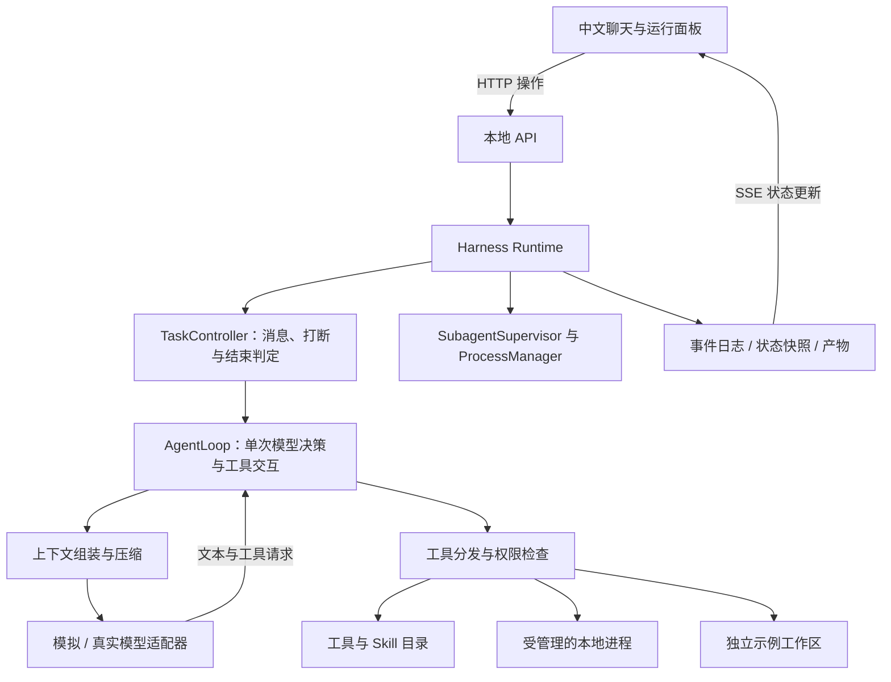

# 实现说明与答辩边界

本文描述当前代码，供团队交接、讲解和制作 PPT。整体设计见 `HARNESS_DESIGN.md`；尚未实现的设计不作为当前能力承诺。

## 整体结构

前端负责展示和发送用户操作，后端维护唯一可信的任务状态。模型只能生成文本和工具请求，不能直接修改授权表或执行系统命令。

核心逻辑位于 `server/`，没有使用现成 Agent 框架。新的 `server/runtime/` 使用严格 TypeScript，只依赖自身契约；`runtime-adapter.mjs` 将它接到既有模型、上下文、存储和任务对象。Node.js 24.12+ 可直接执行这些 TS 文件，类型检查通过独立命令完成。其他后端模块暂时保留 `.mjs`，新增能力模块使用 Node SQLite、YAML 解析与 Ajv 校验。前端使用 React、shadcn/Base UI 和 Vite/vinext，由同一个后端提供静态页面。

当前采用逐步拆分：单助手控制和循环、助手配置、访问范围、协作管理及进程管理已进入 TS 模块；材料准备和结果投递通过适配层接入。工具分发、授权和模型交接仍有逻辑集中在 `Harness`，尚未完成全后端类型化。单助手机制见 [1-核心功能说明](reports/1-核心功能说明.md)，本轮协作机制见 [2-子 Agent 协作设计说明](reports/2-子Agent协作设计说明.md)。

## Agent loop 与用户打断

`TaskController` 拥有每个 Agent 的活动执行句柄、epoch、取消信号和消息消费入口，负责循环推进与结束提交。`AgentLoop.step` 执行一次决策：组装上下文、请求模型、记录完整响应、依序派发工具、记录工具结果，返回“继续”或“候选最终回答”。模型返回纯文本不直接将任务标记完成。模型槽位只覆盖模型请求，不覆盖工具等待和后台等待。

完成候选首先检查邮箱、待处理模型切换、未结束子任务及登记中的在途工作；收尾条件满足后再异步检查成果。检查返回时复核执行编号、输入变化、任务与文件版本，只有新鲜且有效的通过结果才能提交完成。最终复核与状态提交之间不插入异步等待。子任务成功、失败、取消或产生待核实结果时，在父任务仍开放的条件下投递消息。完成通知期间接受的后续消息，会在旧驱动退出后开启新一轮执行。

每个执行轮次拥有 `epoch` 与 `AbortController`。用户立即改变方向时，先使旧 epoch 失效并发出取消信号，等旧执行退出，再按最新目标启动新轮次。每次工具派发前和写入提交前重新校验 epoch；迟到的模型响应只能成为失效记录，不能产生后续工具副作用。

“下一步补充”把带 ID 和来源的消息加入待处理队列；整批写入上下文后才发布 `inbox.consumed`。这个事件表示输入已接纳到上下文，不代表模型已经理解或完成了要求。“停止整个任务”将任务范围设为 closing，禁止继续创建子任务，显式丢弃未接纳消息并记录原因，取消所有相关执行，等待清理结束后再标记已停止。连续两次改方向使用最新目标，原始输入仍按顺序保留。用户自然语言中的只读、停止诊断等快捷行为通过少量中文模式匹配识别，属于演示交互，不是通用意图解析器。

工具调用的流式参数先完整拼接并解析 JSON，再进入运行时；断流或缺少完成标记时不执行半截请求。同一 assistant tool-call 消息及对应的全部结果被保存为一个交互单元，即使中途取消，也补齐未执行调用的取消结果。

**边界**：取消代表阻止后续工作并尝试停止在途工作，不表示回滚已完成写入。远程请求在取消前是否已经产生副作用可能无法确认；当前没有远程写入工具，也没有对外部操作的幂等重试和补偿事务。

消息接纳与终态提交的保证限于当前进程内的串行控制，尚无可重放的持久邮箱事务。本轮已修复子任务初始化失败遗留等待节点，以及主进程退出后同组后代未回收的问题；完成判定仍依赖登记的资源，无法发现任意主动逃逸或后端崩溃后的外部工作。

## 成果检查与用户验收

控制器通过 `verifyCompletion` 接收逐项检查结果，`completion-check.ts` 检查格式并生成失败反馈。结果分为通过、需要修改和需要验收；没有逐项依据或包含未知项时，不能凭一个通过标记完成。失败反馈以运行时资料加入下一步输入，默认允许两次自动返工；之后保留明确失败项进入 `needs_review`。无适用标准或检查器异常也进入 `needs_review`，停止模型循环并保留结果。

`completion-checks.mjs` 提供现有示例的实际检查。匹配原始提示的完整任务链重新运行四项原始测试，核对测试内容、实际执行数量和退出结果；安全与规模场景检查已定义的拒绝、文件和次数标准。自由任务及改变过要求的任务默认人工验收。后台助手没有专属规则时，其待核实结果送交父任务，不阻塞已结束的执行。检查范围通过任务事实和界面公开，不声称这些规则覆盖所有自然语言要求。

`POST /api/sessions/:id/review` 接收当前验收编号和 `accept` / `revise`。通过必须对应当前的待验收结果，并核对任务版本和文件内容；明确失败项不可直接通过。修改操作需要用户填写反馈，再从消息入口继续任务。用户验收只影响成果状态，不增加工具权限。检查记录、依据与通过方式随快照保存；界面区分自动检查通过和用户验收。

控制器的检查接口可接入业务检查方法，开发时通过 Harness 的 `completionCheck` 注入可信函数。它必须遵守取消信号、等待自己的工作结束，并返回逐项依据。没有自动 LLM 裁判或任意规则脚本安装入口。当前文件指纹覆盖工作目录顶层文件并结合框架记录的修改版本；外部系统和新产物需要扩展版本与检查范围。检查仍运行在已有受控本地环境中，不构成恶意代码隔离。

## 子助手协作与资源管理

主模型通过 `agent_spawn` 提交目标、助手类型、材料、背景、预期产出、运行模式和可选模型；程序不自动决定分工。默认 `general` 通用助手可接受临时工作，`analysis` 和 `review` 提供只读配置。`AgentDefinitionRegistry` 从应用 `config/agents/` 读取 JSON 文件头和 Markdown 工作说明，校验配置并为运行中的助手保存版本。模型优先使用本次指定，其次类型默认，再其次继承创建时父模型；允许范围和实际服务配置都要满足。

`SubagentSupervisor` 统一处理检查、登记、准备、启动和关闭。相同父执行和工具调用编号不会重复创建。`SubagentWorkspace` 只复制明确分配的文件或产物，记录内容指纹；源文件和用户要求变化后显示依据变化。材料准备失败会生成失败结果，取消与启动交错时不会遗留活动执行。当前材料准备采用同步、有大小限制的文件复制；不提供多文件原子快照或运行中追加材料接口。

访问检查覆盖可用工具、Skill、文件、目录、历史、产物及后代任务。子助手只接收自己的上下文和分配材料，默认不能继续创建子助手。配置允许嵌套后，下一层能力仍受祖先允许范围、深度及累计预算约束。通用助手可申请写自己的 `outputs/` 目录，分析和检查助手不能通过文件工具写入；批准绑定助手、文件和有效版本，父或兄弟助手的批准不自动继承。请求路径与真实目标都检查，写入使用独占创建的临时文件。

前台与后台复用现有控制器和循环。前台通过原调用等待结果，不占模型或命令名额；后台立即返回任务编号，结束后向父邮箱投递。每个结束结果有稳定编号，只投递一次；长结论保留可回读产物。工作完成和受管理资源释放分别确认，控制器退出后才发布结果。缺少业务检查的结论为待核实资料，最终任务仍须通过已有成果检查或用户验收。

主任务立即改方向时，关闭并取消旧方向的运行中子任务；普通追加说明不自动取消。子任务消息支持下一步接纳和立即调整两种方式。停止分支先禁止派生，再等待控制器和受管资源收尾；重复取消共享关闭过程。父任务失败会取消后代，单个子任务业务失败不默认取消无关兄弟。

`ProcessManager` 已提取到 TS 模块。POSIX 主进程退出、取消或超时时，检查同组后代，先发 TERM，600ms 后必要时发 KILL；确认进程组退出且输出管道关闭后才移除资源记录。清理超过确认期限时保留 `cleanup_unconfirmed` 记录，暂停同任务新的写入、命令执行和委派，阻止最终完成。不会只依据主进程 `close` 就宣称全部回收。

数量限制分别作用于存活子助手、模型请求和受管理命令。默认最多 8 个存活子助手、2 个并发模型请求、4 个并发命令；配置开放嵌套后最多两层。已结束历史不占存活名额。默认助手配置还设有 180 秒时限、1500 轮和 5000 次工具调用上限，后代调用同时计入祖先与全任务调用预算。这些是当前工程配置，不是课程要求的数值。

**边界**：子助手是同一后端进程中的独立执行，不是跨机器 worker。目录与工具权限不能隔离任意恶意脚本；主动脱离进程组、后端强杀、主机崩溃和不可取消远端操作需要更强环境。本轮没有实现容器或持久恢复。Windows 仅提供直接子进程取消，不承诺 POSIX 等价的进程树回收。模拟器用于验证机制，真实模型分工质量尚未评估。

## 千级工具和 Skill

本轮新增 `server/runtime/capabilities/`：解析器保留原文并整理统一记录；存储模块保存 SQLite 管理数据及整包内容指纹；目录模块维护层次、摘要、概述和可见范围；检查与独立评估模块保存证据和版本。`Catalog` 保留原有兼容入口和教学样本，新管理流程通过独立 API 接入，业务循环不负责评分。

模型默认使用 `catalog_browse` 从场景逐层阅读概述，再用 `catalog_detail` 查看候选。目录入口和搜索都分页，搜索可命中概述或 Skill 简介，支持指定子目录及显式跨目录查找。管理页使用相同目录。当前采用关键词检索，不包含向量数据库；自动概述依据真实下级整理，人工概述不会被后台覆盖，内容变动时给出更新建议。子助手看不到的条目不会进入计数或概述。

当前初始目录为 22 个核心工具、1 个固定本地命令、1,200 个生成计算工具，以及 7 份编写方法和 1,200 份生成方法。生成工具共用五类聚合运算，容量测试不代表千种真实业务集成。

导入支持 YAML 文件头的 SKILL.md、普通 Markdown 和本项目明确的 JSON/YAML 交换格式。冲突先保持待处理，由用户选择并保存依据。名称、整包指纹先找精确关系，用途词找到少量比较候选；配置真实模型后可以再比较双方原文。模型意见仍是待确认建议。源码包、作者声明、管理信任、扫描发现和任务授权分别保存。

独立质量评估提供六项 1—5 级分数及原文证据，程序计算等权平均；未覆盖全部适用维度时不出完整总分。独立安全评估给出五方面判断，保留严重风险与覆盖缺口。没有真实模型时只执行规则检查；不会给出模拟评分。评估可排队、取消、重启后标记中断，旧版本报告单独保留。长材料按完整行分段阅读，跨段一致性仍未充分判断时明确显示缺口。

`CapabilityLoader` 是模型、页面和子助手预加载的共同入口，先检查启用、权限、依赖、已确认冲突及完整上下文预算，再一次性写入加载记录。超限返回原因，由模型或用户压缩历史、卸载能力或选择已确认阶段后重试，当前加载器不自动压缩。普通 Skill 完整注入正文，已确认的分段结构注入共同规则和当前阶段。资源与正文锁定同一文件包，支持分页和原文查找；压缩与模型切换继续使用加载快照。

工具加载固定参数定义；固定命令还保存脚本副本与校验值，通过 ProcessManager 执行 Node 进程。工具参数使用严格 Ajv 校验，不认识的规则直接报错。较长结果保留结构和完整产物引用。导入工具不能凭自身的 always、adapter、binding 字段取得执行入口。内置命令、脚本监管和文件范围限制依然不是操作系统沙箱。

单 Agent 最多保持 24 个附加工具和 8 个活跃 Skill，千级容量指目录及累计加载能力。MCP 客户端、来源签名验证、向量检索和任意产品格式适配尚未实现。具体使用方式与本轮核验见 [3-Skill 与工具管理设计方案](reports/3-Skill与工具管理设计方案.md)。

## 上下文压缩

`ContextManager` 把任务目标、用户要求、当前授权、只读状态、近期已完成操作、在途操作和后台状态从运行时重新组装，避免完全依赖自由文本摘要。较早的完整交互可以压缩，最近三个交互单元和未完成工具交互保留。完整原始事件与长输出存到外部文件，可用 `history_search` / `artifact_read` 查询。

当前摘要支持独立模型整理和带来源的节选回退。输入按各模型窗口减去输出预留与 5% 估算余量；超过可用空间 75% 时尝试压缩。候选结果必须实际缩小、且不超过 80% 目标空间，摘要上限同时受剩余空间和 22% 比例限制；这些是 Demo 策略参数。摘要与原文归档准备完成后才替换历史，仍超限则明确失败。摘要有损，引用检查不能证明语义完全忠实。详见第四份说明。

压缩先记录候选单元和任务/轮次/上下文版本，异步准备后再次检查，只有版本一致才提交。用户打断或模型切换造成版本变化时，旧压缩结果丢弃，避免覆盖新上下文。

**边界**：token 数是字符启发式估计，不是供应商 tokenizer；内部推理/多模态载荷的费用与窗口不能据此精确核算。摘要本身可能遗漏旧证据，模型需要回查原文。日志保留不等于模型一定会正确检索和使用它。

## 模型切换与回答质量

`requestSwitch` 将运行中的切换请求排到下一次完整工具交互之后。`applySwitch` 先准备候选交接上下文，包括目标、用户要求、有效授权、近期结果、后台状态、摘要和活跃能力；检查目标模型配置、工具支持和窗口预算，成功后一次提交，失败保留原模型与历史。

后台 Agent 的模型保持启动配置。两个真实模型配置当前要求共享协议和服务配置，只有文本及函数调用场景；不迁移内部隐状态。Responses 同模型续接保留服务返回的原生 output；跨模型交接转成可见任务事实，不把供应商内部状态复制给新模型。

这套机制解决“换模型时忘记任务在哪里、有哪些限制、哪些工作已做”的问题。它无法保证新模型本身的推理能力与旧模型一致。当前没有兼容性自动探测、自动质量评分、语义理解确认或自动回滚到更强模型，也没有模型层面防重复写入的数学保证。代码不会自动重放旧调用，交接中要求不重复已完成操作；新模型仍可能重新提出相同操作，需要运行时权限与后续评测共同约束。

真实适配器实现了 Responses 和 Chat Completions 两条流式路径，包含超时、取消、错误、参数拼接和完整性检查。已用模拟协议流测试，尚未使用真实密钥联调。实现参考 [OpenAI 函数调用文档](https://developers.openai.com/api/docs/guides/function-calling)。

## 安全性、可靠性与趣味性

安全由后端工具入口执行：参数类型和范围检查、路径规范化与符号链接越界检查、子任务写入限制、测试与环境文件保护、用户授权。单次授权绑定具体调用参数；持续授权绑定该任务内的具体助手、工具和文件路径，可以撤销，不扩展到父子或兄弟助手。批准带任务版本、Agent 轮次与授权版本，迟到的批准不能复活旧调用；真正写入前再次核对授权版本，覆盖等待写锁期间撤销的竞态。

Skill 的不可信标记在教学反例中预置，加载不增加权限。能力管理已有可接真实模型的独立安全评估，但运行时没有通用 LLM 操作安全裁判、通用提示注入检测、Skill 签名验证或操作系统沙箱。测试会执行工作区内代码，因此文件路径限制不是任意代码执行时的安全边界；真实模型生成的修改也应由操作者审阅。

可靠性方面，事件序号和 JSONL 记录支持核查，快照用临时文件替换保存，SSE 断线后发送当前快照与近期事件。近期缓冲不能替代完整历史，旧事件可通过查询接口或磁盘记录读取。后端重启把未结束任务标为 interrupted，不自动重放在途写入，不根据历史 PID 杀进程。没有完整事务 WAL、日志损坏恢复、自动补偿或高可用恢复；磁盘写入异常仍可能导致服务失败。

本轮新增独立桌面小伴：Web 入口与 macOS Swift 浮窗复用页面，只读查询所选任务历史，独立保存对话与有明确对象的反馈。模型调用可取消，窗口断连会回收自己的请求。反馈可导出、清空，不自动进入训练或验收规则。界面改为浅色对话工作台，运行面板默认收起。详见第五份说明。

## 验证依据

`test/core.test.mjs` 验证基础队列、路径、目录、事件序号和进程回收；`test/runtime.test.mjs` 验证完整任务链、权限撤销、打断、后台限制、压缩和交接；`test/models.test.mjs` 验证模拟协议流；`test/http.test.mjs` 验证 API、SSE 和本地来源限制。

`test/task-controller.test.ts` 与 `test/agent-loop.test.ts` 用内存适配器验证控制边界，不依赖目录、工作区或 UI；`test/first-round.test.mjs` 验证这些边界接入现有 Harness 后的消息、后台结果和取消行为。2026-09-10 第一轮重构后，完整测试为 51 项通过，严格运行时类型检查与 lint 通过。测试覆盖不代表此前核查发现的其他缺陷已经解决。

随后成果检查补充新增 20 项测试，该阶段完整 71 项通过。`completion-control.test.ts` 检查控制器的验收分支与时序，`completion.test.mjs` 检查实际成果与返工，HTTP 测试覆盖验收接口和保存。运行时及前端类型检查、lint 和静态构建通过；隔离预览中完成了成果验收的浏览器交互检查。具体记录见 [成果检查补充记录](reports/COMPLETION_CHECKS.md)。

本轮子助手协作新增 26 项测试，当前完整 97 项通过。`agent-definitions.test.ts` 检查配置；`subagents.test.mjs` 检查通用任务、材料与权限隔离、模型选择、前台等待、取消、去重、资源未确认及真实进程组回收；HTTP 测试增加完整委派参数与结果验证。运行时严格类型检查、前端类型检查、lint 和静态构建通过；独立临时预览完成了通用助手创建、文件分配、审批写入、只读助手、工作范围和待核实标签的浏览器检查，未发现前端错误。

`scripts/scale.mjs` 独立生成容量与累计调用报告。测试没有覆盖真实模型的分工与长任务回答质量；正式展示前仍应在演示机器上配置 API，按 `DEMO_GUIDE.md` 走一遍交互。

## 本轮交接修正与业务示例

模型切换先保留全部可见历史，不再只取最近三个单元；去掉原模型专用响应，在目标窗口放不下时对独立候选状态压缩，复核任务和历史变化后提交。失败保留原模型与历史。

新增隐私实体数据集的合成教学示例，规则与材料在 `server/privacy-demo.mjs`，业务成果检查挂在 `CompletionChecks`，没有把 PERSON／EMAIL 等示例标签写进通用控制器。自由任务的模拟模型只说明限制，不执行无关的预设修复。

内置工具合同随代码升级时生成新包版本，旧版本继续保存；避免旧能力库覆盖新参数定义。已固定加载的任务版本仍按原规则处理。
