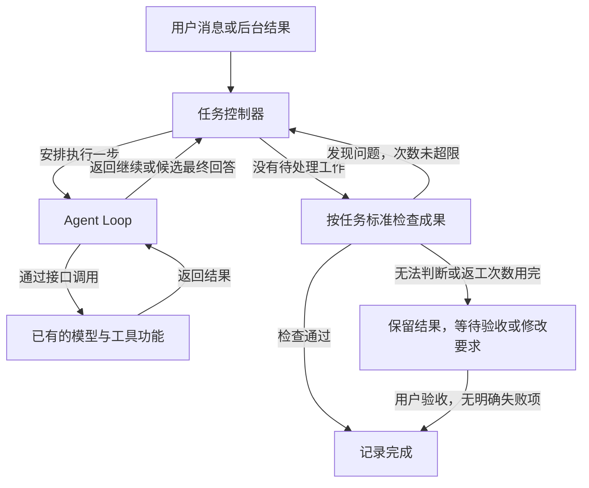

**1-核心设计说明：任务控制器、Agent Loop 与成果检查**

本文说明第一轮核心重构及本次补充的成果检查：任务如何启动、如何一步步执行、如何接收新消息，以及如何改方向、停止和确认完成。工具加载、Skill、历史压缩等已有功能通过接口继续使用，它们内部的实现没有在这一轮重新设计。

**一、为什么分成这两部分**

原来，接收用户消息、调用模型、执行工具、处理后台结果和判断结束，集中在同一段较长的执行逻辑中。修改结束判断时，容易漏掉新消息；处理打断时，也容易影响工具结果的保存。

现在分成两部分：

- **任务控制器**负责决定什么时候开始、什么时候继续、什么时候停止，以及执行和成果都满足条件后，什么时候可以结束。
- **Agent Loop**负责完成一步工作：请求一次模型，执行这次返回的工具调用，保存结果。

代码中的 Agent Loop 提供一个 `step` 方法，每次只执行一步。真正反复调用这一步、推动整个任务向前的，是任务控制器。

主助手和每个后台助手各有自己的控制器，使用同一套执行规则。

这样拆分后，处理用户控制的代码和执行模型决策的代码可以分别检查、分别测试。

**二、任务控制器如何管理执行**

控制器保存当前是否正在执行、执行状态、还没交给模型的消息，当前执行的编号和停止信号，以及最新的成果检查记录。

**启动时，先登记正在执行，再开始工作。** 如果执行尚未退出，又收到一次启动请求，就复用已有执行，不再额外启动一套。先登记再运行，是为了避免程序刚发出启动通知，又有新消息触发重复启动。

**补充消息时，先放入待处理列表。** 每条新消息记录自己的编号和来源，例如用户或后台助手。在下一步执行前，控制器通过接口把这一批消息写入上下文，也就是后续交给模型的输入记录。写入后才发出“这些消息已加入输入记录”的通知。

这个顺序很重要：如果通知刚发出，用户就改了方向，消息也已经保存在输入记录中，不会在两次执行之间丢掉。进入输入记录，不表示模型已经理解或完成了要求。

**改方向时，先让旧执行失效，再通知它停止。** 控制器会更新当前执行编号。旧模型请求即使较晚返回，也会因为编号不再匹配而失效，不能继续安排工具操作。等旧执行退出后，才开始新执行。连续改几次方向时，外层入口保存最新目标，控制器负责保证旧执行退出后只启动一套新执行。

这里同时保留编号检查和停止信号，是因为停止信号需要正在运行的代码配合；编号检查可以进一步挡住迟到的旧结果。停止某个请求不一定瞬间完成，所以新执行仍可能需要等待。

**停止时，不安排重启。** 控制器记录哪些待处理消息被丢弃，并通知当前执行停止。整个任务的停止入口会分别调用主助手和后台助手的控制器，等待它们退出。已经完成的文件修改会保留，停止不等于撤销之前的操作。

**三、Agent Loop 如何执行一步工作**

一次 `step` 按下面的顺序执行：

1. 检查这次执行是否仍然有效，再通过接口准备模型输入。
2. 再次检查，然后请求模型。模型逐段返回的文字也只有在执行仍有效时才会继续发布。
3. 模型返回后再检查一次，挡住打断之后才到达的旧响应。
4. 如果返回了工具调用，按顺序处理参数、调用工具并保存每项结果。
5. 这批工具处理结束后，返回“继续”，由控制器安排下一步，把刚得到的结果交给模型。
6. 如果模型没有提出工具调用，则返回“候选最终回答”，交给控制器判断能否结束。

模型连接、权限检查、实际文件操作都通过接口接到原有功能。Agent Loop 负责执行顺序，不需要知道每个工具内部怎么实现。

每项工具执行前都会再次检查是否已被打断。参数不是完整、可解析的内容时，该工具不会执行，会保存错误结果供后续模型查看。普通工具错误可以作为结果返回；取消或达到执行上限时，则停止继续安排工作。

同一次模型请求中的工具调用与结果要一一对应。例如，模型要求先读取文件、再执行检查，如果读取已经完成、检查开始前用户停止，程序会保留读取结果，并给后面的检查记录“未执行，已取消”。这样下一次查看历史时，能分清实际做过什么、哪些步骤没有执行。

**四、任务控制器怎样确认完成**

现在分两层判断：先确认执行过程已经收尾，再检查成果是否满足当前任务配置的标准。

**第一层：还有没有事情没处理。** 模型返回候选最终回答后，控制器检查有没有新消息、待切换模型、未结束的子任务，以及程序登记中还在进行的操作。有新消息就继续下一步，有后台工作就等待其结果，再让模型决定下一步。

后台助手成功、失败或取消时，只要父任务仍在接收结果，连接代码就会把结果加入父任务的消息列表。后台结果无法自动验收时，也会明确标注，交给主助手作为待核实资料。

**第二层：成果有没有通过检查。** 第一层通过后，控制器进入“检查成果”状态，调用任务配置的检查方法。检查方法返回检查项目、依据和结论；检查标准由程序中的任务配置提供，模型不能通过一句“已经完成”改变标准。

检查结果有三种处理方式：

- **检查通过**：所有配置项目有明确的通过结果，才允许自动记录完成。只有一句“通过”，却没有逐项依据，不算有效结果。
- **发现问题**：把具体失败项目和依据加入下一步模型输入，让模型补充工作，再重新检查。当前默认最多自动返工两次，仍未通过就停下来，保留结果和原因，等待用户提出修改要求。
- **无法判断**：没有适用规则、检查器出错或结果不完整时，进入“待验收”，不自动记为完成。用户可以查看结果后确认，也可以说明需要修改什么，再继续执行。

对于已经明确失败的检查，界面不会提供直接验收通过的按钮，后端也会拒绝这一操作。用户可以修改要求后继续工作。验收成果和批准工具操作是两回事，验收通过不会增加文件写入权限。

**检查必须针对当前这份结果。** 检查可能需要一段时间，期间用户可能补充要求、停止任务，文件也可能变化。因此检查前会记下当前要求和文件的版本，检查返回后再核对。如果已经变化，就放弃旧结论，重新决策和检查；如果已经停止，迟到的通过结果也不能让任务恢复完成。

用户点击验收时，同样要核对它对应的结果是否仍是当前版本。旧结果的验收请求、重复验收、停止后到达的验收请求都会被拒绝。最后核对和写入完成状态之间不插入异步等待，写好状态后才发出完成通知。通知期间收到的后续消息，会在旧执行退出后启动新执行。

**当前已经接入的实际检查。** 现有代码修复示例会重新运行原始测试，检查测试文件没有被改动、所有原有测试确实执行且通过；不能只看程序退出码为零。检查失败的输出会交给模型，完整测试输出单独保存。安全反例和千次调用演示，则按各自已有目标检查拒绝记录、文件内容或调用次数。

这些自动检查只用于匹配原始要求的预设演示任务。自由输入的任务，或后来补充、改变过要求的任务，默认需要用户验收，避免继续用旧标准替新要求作保证。后台助手没有适用的自动标准时，会结束执行并返回待核实结果，不会一直占着执行位置等待人工操作。

自动检查通过，表示配置的项目通过；检查标准是否覆盖用户全部要求，仍需要在具体任务中明确。当前没有增加一个大模型来自动制定或批准验收标准，也没有实现隐私实体的具体标注质量规则。文件变化检查目前覆盖工作目录顶层文件和框架记录的修改，新业务产物需要纳入相应检查范围。实际执行程序的清理仍依赖原有管理功能。

**五、两部分怎样接入现有代码**

任务控制器通过接口调用 Agent Loop 的一步执行。Agent Loop 再通过接口请求模型、执行工具、保存记录。连接代码负责把这些接口接到现有系统。

例如，控制器只需要询问“还有没有待处理工作”和“成果检查结果是什么”，由连接代码去查询或检查；Agent Loop 只需要提出“调用这个工具”，由原有工具入口检查权限并执行。控制器决定如何处理检查结果，具体业务检查方法放在外面。

对应代码分工是：

- [任务控制器](../server/runtime/task-controller.ts)：启动、消息、改方向、取消、反复推进和完成判断。
- [Agent Loop](../server/runtime/agent-loop.ts)：一次模型请求及其工具执行。
- [接口说明](../server/runtime/contracts.ts)：规定双方传递的消息、执行结果和可调用的方法，使用 TypeScript 检查。
- [成果检查结果处理](../server/runtime/completion-check.ts)：检查返回内容是否完整，整理交给模型的修改反馈。
- [具体成果检查](../server/completion-checks.mjs)：保存预设任务的检查标准，重新运行测试或检查已有记录；自由任务转人工验收。
- [连接代码](../server/runtime-adapter.mjs)：把新核心接入模型、上下文、工具、成果检查和任务记录。

新核心可以用简单的模拟接口单独运行测试。以后更换模型连接方式或具体工具实现，可以尽量保留控制器和 Agent Loop 的执行规则。当前部分会话状态仍由原有入口维护，所以第一轮还不是整个后端结构整理的完成版。

**六、这一轮如何验证**

我们先写出能复现问题的测试，再修改实现。第一组测试复现了最终回答期间遗漏用户补充、遗漏后台结果，以及完成通知期间丢失后续消息的问题。修复后，这些场景全部通过。

随后又验证了两个更细的时机：消息刚通知“已加入输入记录”就发生改方向，以及程序刚通知“开始思考”就被取消。这两个场景推动我们调整了消息写入顺序，并在发送模型请求前补上检查。

第一轮新增了 16 项测试。本次成果检查又新增 20 项，覆盖失败后修改、返工次数限制、未知结果待验收、检查期间的新消息和停止、旧验收请求失效、修改测试不能降低标准，以及验收结果保存等情况。当前完整 71 项测试全部通过，TypeScript 检查和代码规范检查通过，前端构建通过。

浏览器中使用隔离的临时示例，实际检查了“待验收—提出修改—重新返回结果—验收通过”的交互。真实模型服务和具体业务成果质量尚未在本次验证。

本次确认的是：执行收尾和成果检查都有明确入口，检查不通过不能直接结束，无法判断会交给用户，旧结果不能替新任务作保证。成果是否全面正确，取决于具体检查标准和验收质量。

代码与验证的详细记录见：[成果检查补充记录](COMPLETION_CHECKS.md)。第一轮历史记录保留在[第一轮重构记录](FIRST_ROUND_REFACTOR.md)。
