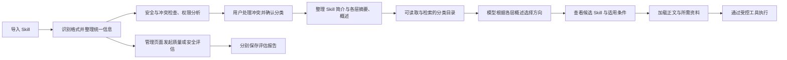

**3-Skill 与工具管理设计方案（第三版，设计与本轮实现）**

本轮已按确认的方向修改代码。下文先说明当前实现与验证，再保留设计依据和详细方案。它接在《1-核心功能说明》和《2-子 Agent 协作设计说明》之后；前两份说明的内容没有改变。

已经确认的方向是：把 Skill 管理作为重点，内置安全扫描、冲突扫描、分类分级索引、权限需求分析和质量评估；工具也需要相应的管理能力；运行过程中支持千级目录的发现、按需加载和长 Skill 管理。质量评估在独立管理页面进行，评价 Skill 本身，不以使用后是否提高业务任务成果作为评分依据。

本版的重点是“多层分类 + 每层可读取、可检索的摘要和概述”。场景与类别构成目录，各层概述解释用途和下级能力的区别；模型根据这些信息选择深入方向，人也使用同一份目录进行审查。这个方向已在调研后确认；下面的实现记录区分已经落地的机制和仍然保留的边界。

导入冲突由用户选择处理，系统给出建议；五级质量评估、独立安全评估和可信来源标注继续保留。格式统一、长 Skill、版本与权限的设计也继续纳入本模块。本文不以模型使用后的业务成果给 Skill 评分。

详细设计中的“建议”保留原方案语境；当前代码能力以本节实现记录为准。本轮讨论正常工作流程和模块职责，不展开复杂故障、完整沙箱或自动解决所有冲突。

**本轮实现记录（2026-09-10）**

页面入口是工作台左侧的“能力管理”，地址 `/capabilities/`。它是独立页面，工作台原来的小目录保留为快速加载入口。默认目录把“隐私实体数据集构建”“工作方法与运行控制”“教学规模样本”分开，先看用途，再进入具体类别。隐私实体示例包含边界、标签和重叠三份检查方法；它们不替用户决定数据集标签体系。

| 设计内容 | 当前如何落实 |
| --- | --- |
| 多层分类和每层概述 | 管理页与 `catalog_browse` 共用目录；摘要说明下级范围，概述列出用途差异，完整入口分页读取。`catalog_search` 可在子目录或全部目录查概述和能力简介，`catalog_detail` 查看候选后才加载 |
| 概述维护 | 从真实下级内容自底向上整理，保留人工修改；下级变化后生成更新建议并标记待更新。当前没有接入向量检索或自动语义改写目录概述 |
| 导入与格式 | SKILL.md 的 YAML 文件头、普通 Markdown、本项目明确的 JSON/YAML 格式分别解析；单份或多份目录导入都保留原文。单次请求限制 5 MB，每份文本包限制 4 MB / 500 个文件，集合最多 1,000 份；大集合可分批 |
| 冲突处理 | 名称、整包指纹和用途词先筛选候选，真实模型可再比较双方原文；建议不会自动启用。用户可逐项或批量处理，保存双方版本、依据和决定；两份能力的矛盾经人工确认后不能同时加载 |
| 安全扫描与安全评估 | 规则扫描正文、资料和脚本，只读不执行；安全评估独立发起，提供五方面判断、证据和未覆盖内容。禁止项不能因用户信任或高质量分而消失 |
| 五级质量评估 | 管理页单项或批量发起，检查方法或工具说明本身；六个维度按 1—5 级评分，原文证据逐项核实，再由程序计算完整适用项平均分。缺少真实模型或未覆盖的维度不制造分数 |
| 来源与权限 | 作者声明保留在原始信息中；实际来源、核实依据、用户信任单独保存。信任来源可显示在同来源条目上，但不自动授予任务权限；必要工具依赖在加载时检查 |
| 整包版本 | SQLite 保存目录、报告和管理决定；正文、资料、脚本作为同一份带内容指纹的文件包保存。新版本不继承旧评分，已加载资源继续读取旧包 |
| 统一加载和长 Skill | 页面、主助手、子助手预加载共用一个加载器。先检查启用、权限、依赖、已确认冲突和上下文容量，成功后才写加载记录。长 Skill 可按人工确认的“共同规则文件 + 阶段文件”加载，资源可以分页或查找原文 |
| 工具执行 | 固定工具定义，Ajv 严格校验参数；可信本机配置可登记固定 Node 命令，命令脚本有副本和校验值，进程由既有管理器回收。导入文件不能自行指定可执行入口；长结果保留完整产物引用 |

主要代码按职责拆开：

- `server/runtime/capabilities/`：文件包存储、格式解析、扫描、冲突候选、目录与评估队列。
- `server/capability-loader.mjs`：所有运行入口共用的加载检查、阶段选择与固定版本资源读取。
- `server/capability-reviewer.mjs`、`server/conflict-review.mjs`：隔离业务上下文的模型阅读与比较。
- `server/capability-routes.mjs`：独立管理操作；不会借业务 Agent 执行被评材料。
- `server/command-tools.mjs`、`server/tool-schema.mjs`、`server/tool-result.mjs`：固定命令、参数校验和长结果保存。
- `web/app/components/capability-*`：目录页面、导入处理、详情、评估报告分别组织，避免继续堆进聊天页面。

这次验证包括 115 项自动化测试全部通过，严格核心类型检查、代码检查和前端构建通过。规模脚本通过完整循环执行 1,005 次教学工具计算，又经真实调度入口完成 1,200 个不同工具的加载、调用、卸载和 1,207 份 Skill 的加载、卸载，错误为 0，结束后活跃进程为 0。详见 [规模报告](scale.json)。

另一次目录测量中，初始目录为 1,223 个工具和 1,207 份 Skill；根目录只返回 3 个入口，约 501 个估算 token。实际加载并卸载 1,001 份教学 Skill 后，活跃 Skill 为 0。耗时属于本机这次运行，不能当成普遍性能承诺，详见 [目录与加载测量](capability-scale.json)。这些测试证明机制与规模容量，不证明千份生成方法的业务质量，也不证明真实模型能可靠完成千步规划。

**仍需明确的实现边界**

加载超限时会完整拒绝，提示先压缩历史、卸载或选择已确认阶段；加载器当前不自行压缩。分阶段结构按文件明确配置，尚不支持在页面中自动拆出任意正文段落。没有分段确认的正文不会自动裁掉共同要求。

长材料评估会按完整行分片阅读并保留局部证据；跨片段的一致性尚不能充分判断时，报告保留缺口，不出全文总分。独立模型调用接入现有真实模型适配器，未配置密钥时可以验证规则路径、队列和报告规则；本轮自动测试使用受控模型返回验证接口与证据检查，没有把它当成真实模型评分效果。

本轮只接受文本文件包，不处理二进制附件。其他产品格式需要明确适配；导入工具定义不会自动连上远程服务。MCP 客户端、来源签名验证、完整操作系统沙箱、向量检索没有作为已实现功能交付。来源“已核实”指用户提交的核实记录，内容指纹本身不证明发布者身份。

对旧会话中尚未固定整包版本的加载记录，原有正文仍保留；需要读取新版本资源时应卸载后重新加载，不能把现目录的资源偷偷算作旧版本。生成样本只在缺少文件时初始化，直接编辑初始目录不会覆盖已经保存的受管快照，需要重新导入。

---

**一、参考依据与整体流程**

本方案主要参考以下公开资料。表中的“我们采用什么”是本项目的选择，不代表来源已经提供了我们全部的管理功能。

| 参考 | 公开资料说明的做法 | 我们采用什么 |
| --- | --- | --- |
| [Agent Skills 规范](https://agentskills.io/specification) | 用 `SKILL.md` 和附带资料组织单个 Skill，先看简介，再读取正文和资源 | 叶子节点继续兼容标准 Skill，保留原文与按需读取方式 |
| [LangChain 的层级 Skill 扩展](https://docs.langchain.com/oss/python/langchain/multi-agent/skills#extending-the-pattern) | 提出由上层能力引出下层专门能力、按需发现和加载的树状组织方式 | 按场景和类别组织能力，由模型选择深入方向；该资料将其列为自定义扩展，并非默认已经实现的分类管理器 |
| [OpenViking 的目录内容分层](https://docs.openviking.ai/en/concepts/03-context-layers) | 为目录组织简短摘要、概述和原始内容，支持先判断相关性，再读取细节 | 每层有摘要和概述，目录内容本身可以被读取和检索，概述从下级内容逐步整理 |
| [skills.sh 的公开接口](https://www.skills.sh/docs/api) | 提供 Skill 目录、搜索、来源、详情和安全审计结果 | 参考管理信息与原始内容分别展示，安全报告保留独立依据 |

OpenViking 的自动检索结合了搜索起点选择和沿目录递归检索；本项目保留主模型依据目录概述选择分支的方式。我们借鉴它的目录信息组织，不照搬整套检索算法，也不假定它会替我们完成场景分类、用户冲突处理和管理页面。[OpenViking 检索机制](https://docs.openviking.ai/en/concepts/07-retrieval)

管理页面解决“我们有哪些 Skill，它们写得怎样、有什么问题、适合做什么”。任务中的加载机制解决“这一步用哪个 Skill，需要读哪些内容，允许做哪些操作”。两边使用同一份目录，但管理评估有独立的输入、操作和报告。



导入后的基本检查可以自动进行。系统展示冲突和建议分类，由用户处理后决定是否启用，并更新相关目录的摘要和概述。质量评估和安全评估在管理页面分别发起，可以选一个或一批 Skill，报告关联到目录条目供人和模型查看。任务运行中的加载次数、耗时和报错属于运行记录，不自动改写 Skill 质量评级；业务成果仍由已有的任务完成检查负责。

目录是否收录、冲突是否处理、是否启用、质量与安全是否已评估、来源是否被信任、某次操作是否获准，需要分别表达。一个 Skill 可以已经收录但尚未启用，也可以已经启用但尚未评估，不能把它们挤进一个“通过”状态。

**二、不同格式怎么统一：保留原文，在导入时建立统一记录**

建议增加统一的 meta 信息，但在导入时就整理，而不是等到加载时再生成。否则搜索、安全检查和评估都没有一致的资料可用。

Agent Skills 的公开规范采用 `SKILL.md`：文件头为 YAML，后面是 Markdown 正文，旁边可以有脚本、参考资料和模板。规范也提供可扩展的 `metadata` 字段。我们可以将它作为优先支持的格式，但外部文件中的 metadata 不等于本系统的管理记录。[Agent Skills 格式规范](https://agentskills.io/specification)

建议先支持以下入口：

| 输入 | 如何处理 |
| --- | --- |
| 标准 `SKILL.md` 目录 | 解析文件头、正文和相对路径引用，保留整个文件包 |
| 当前项目生成的 Skill | 用现有格式的读取器接入同一目录，明确保留“教学生成样本”标记 |
| 普通 Markdown 说明 | 原文保留，补充名称、简介和入口位置；自动提取的信息在管理页可修改 |
| 其他产品的 JSON、YAML 或自定义目录 | 为已知格式增加专门读取器，明确字段对应关系和不支持的功能 |

这里的统一是“读取器把不同输入转换为同一种内部表达”。不能因为一个文件能解析成 JSON，就声称已经兼容它所属产品的全部运行方式。遇到专有命令、生命周期回调等我们没有实现的内容，应显示兼容性缺口，不能当成普通文字就宣称可用。自定义格式具体优先支持哪些来源，还可以在实施时按实际样本确定。

统一记录分开保存下面几类信息，避免互相覆盖：

| 信息 | 用处与来源 |
| --- | --- |
| 原始材料 | 原文件头、正文、脚本、参考资料、模板；保留原始路径和内容 |
| Skill 简介与目录归属 | 场景和类别关联、名称、用途、适用条件、关键词、输入输出说明；由读取器提取，必要时由模型建议，分类由管理者确认 |
| 来源与版本 | 来自哪里、用哪个读取器、对应哪一份文件包，以及来源核实情况；系统记录，不依赖名称是否唯一 |
| 内容结构与依赖 | 正文入口、章节、资料引用、需要的工具或环境，以及哪些属于明确声明、哪些是分析推测 |
| 检查和评估 | 安全扫描发现、冲突关系、五级质量评分、独立安全报告及证据位置和适用版本，分别保存 |
| 管理决定 | 冲突处理选择、启用状态、确认过的分类或兼容映射、用户标记可信的范围；由应用管理操作保存 |

用户对具体任务、文件、网络目标的授权仍保存在现有授权模块中，不写进 Skill 内容。外部 Skill 自称“可信”“已批准”“质量优秀”，只能作为作者声明展示，不能变成系统检查结论或用户授权。

自动补出的简介、分类、权限推测都应保留其来源，至少能区分“原文声明”“系统分析”“人工确认”。模型生成的说明可以帮助搜索，但不能悄悄改写原文的要求。

本地存储建议采用“原始文件包 + 本地数据库”。文件包保存正文和资源；数据库保存统一记录、检索索引、检查报告和管理状态。具体数据库实现通过存储接口隔离，不让运行循环依赖数据库表结构。

分类目录另存自己的名称、简短摘要、目录概述和下级关系。这些信息属于目录，不需要逐份写回下属 Skill 的文件头。Skill 简介解释一份能力，目录概述解释一组能力；它们都用于发现，但各自维护。原始 Skill 及其版本仍然独立保存。

同名 Skill 用来源和内部标识区分，不互相覆盖。每次导入或更新，对正文和相关资源一起计算内容指纹，并在受管理目录保存这一版本的文件包副本；不能只给 `SKILL.md` 标版本，旁边的脚本和参考文件却随时变化。作者写的版本号可以展示，但系统判断内容是否变化依靠文件包指纹。后续读取使用已保存的版本副本，更新源文件通过重新导入产生新版本。

加载时只从这份统一记录中取出当前模型需要的信息：选中的 Skill 和版本、适用说明、正文、必要的使用限制、依赖提示和资源入口。扫描全过程、全部历史报告和后台管理字段不必塞进模型上下文。

**三、安全扫描、独立安全评估与来源标注**

扫描对象包括文件头、正文、引用资料和随包脚本。导入检查只读取文件，不执行脚本。

建议分两种检查。程序规则负责比较明确的问题，例如引用越出文件包、能够识别的操作与声明权限不一致、脚本包含网络访问或大范围文件操作。模型辅助检查负责理解自然语言，例如是否要求忽略用户限制、把工作资料发送给无关目标，或者用不明显的描述要求危险操作。

每条发现应直接显示：哪个文件、哪一段内容、可能发生什么、判断来自规则还是模型，以及建议怎么处理。引用危险指令作为反例，不应仅因出现关键词就被自动判为恶意；证据不充分时显示“需要核实”。

管理页面可以显示“发现明确问题”“有待核实项”“本次未发现问题”“尚未扫描”。“未发现问题”只描述这次检查，不命名为“绝对安全”。明确违反系统禁止规则的内容不能启用执行；可疑内容保留报告供管理者处理，模型检查意见本身不能扩大权限。

模型辅助扫描把 Skill 当作待分析材料，使用独立输入，不提供执行被扫描脚本的工具，也不携带业务对话和业务文件。模型服务不可用时，规则检查仍然能做，但界面要显示哪些检查没有完成。

运行阶段继续检查每次实际工具操作。即使 Skill 检查没有发现问题，写文件、执行命令和联网仍要经过现有授权与执行入口。安全扫描和运行权限是互相补充的两道检查。

在这些扫描发现之外，增加管理页面中的“安全评估”操作，与“质量评估”分别发起、分别出报告。扫描负责找到具体线索；安全评估把线索、正文要求、依赖、权限需求和来源情况放在一起，回答这份 Skill 有哪些风险、依据是什么、使用时需要哪些限制。

独立安全评估建议检查以下方面：

| 方面 | 评估内容 |
| --- | --- |
| 指令与授权 | 是否要求绕过用户约束、扩大权限，是否要求执行与用途无关的操作 |
| 数据访问与去向 | 要读取哪些材料，是否发送数据，发送目标和目的是否明确 |
| 文件与命令影响 | 是否改写、删除文件或执行代码，影响范围是否清楚 |
| 权限是否必要 | 申请的能力是否能由用途解释，是否存在明显过大的要求 |
| 脚本与外部依赖 | 哪些实现能检查，哪些只能看到接口说明，哪些行为尚无法确认 |

每项给出风险判断、证据和处理建议。总体建议使用“低风险”“中风险”“高风险”，没有评估则显示“未评估”，关键材料不足则显示“无法充分判断”。等级具体含义是：低风险表示在已检查范围内影响明确且未发现明显越权；中风险表示存在需要额外限制或核实的操作；高风险表示发现明确越权或重大危险操作。正常的联网和写入不能只因操作类型就被机械判为高风险，需要结合目标与范围。

风险不通过平均分抵消。已有明确严重问题时，即使其他方面表现正常也要保留高风险结论；关键依赖无法检查时，报告显示覆盖缺口，不能评为低风险。质量的五级评分与安全风险分开展示，低质量不直接意味着高风险，高质量也不能抵消风险。

安全报告绑定文件包版本，记录依据、检查覆盖范围、规则和模型。已有扫描结果可以复用，但安全评估有自己的综合判断和报告；并非把扫描结果列表改个标题。重新评估可查看变化，版本更新后旧报告不当作当前报告。安全评估同样不执行被评 Skill 的脚本，不自动读取任务资料或授予权限。

来源标注单独显示三件事：实际从哪里导入、来源是否已经核实、用户是否将这一来源或这份 Skill 标为可信。例如“来自团队仓库”“来源未核实”“用户标记可信”可以直接展示。标记可信时保存用户所选范围和依据；原文件自称官方或可信，不能自动取得这个标记。内容指纹用于确认是否同一份文件，不能单独证明发布者身份。

“来源已核实”要有对应的核实记录，没有依据就保留未核实。用户信任某个来源后，后续版本可以继续显示该来源的信任标记，但新版本的安全评估仍需更新。来源信任、内容风险和实际执行授权分别判断；可信来源照常扫描，内容仍受系统禁止规则与任务权限约束。

**四、导入冲突：系统解释问题并给建议，用户选择处理方式**

导入时先保存待处理材料、完成扫描、展示与已有条目的差异。存在冲突的新材料在用户处理前不进入模型可加载目录，已有条目继续保持原状态。管理页面可以查看待处理材料，处理建议不会自动替用户提交。

建议按下面几种情况提供默认意见和其他选项：

| 类型 | 推荐意见 | 用户可选处理 |
| --- | --- | --- |
| 名称相同、来源不同 | 两份保留，用来源区分 | 保留两份并设置显示名称，或跳过新条目 |
| 文件包内容完全重复 | 跳过重复导入 | 跳过，或为已有内容补记本次来源 |
| 同一 Skill 的新版本 | 保留旧版，审阅差异后决定是否启用新版 | 启用新版，或仅保存新版待处理 |
| 功能相近 | 并存，标为备选或可组合 | 接受关系建议、调整适用场景，或标记为无冲突 |
| 对同一工作提出相反要求 | 保持已有项启用，新项暂不启用 | 继续停用新项、改用新项并停用旧项，或修改适用范围后重新检查 |

每张冲突卡展示双方名称、来源和版本、冲突原文、产生问题的条件、推荐意见及理由。用户可以接受建议或另选处理；系统保存选择和所对应的版本，不直接删除、覆盖或合并正文。修改显示名称也不改写原文件里的名称。

批量导入时，将同类问题分组，用户可以明确选择把某项处理应用到选中的条目，不要求逐个点击千份 Skill。尚未处理的条目保留待处理状态；已经处理完成的条目可以继续入库。明确违反系统禁止规则的内容，不能靠冲突处理选项获得执行资格。

例如，“识别原文中的隐私实体”和“把隐私实体替换为占位符”可能是前后步骤，不能因为都处理隐私就判为冲突。只有它们要处理同一阶段、同一份输出，而一个要求保留原文、另一个要求替换原文时，才需要进一步确认。

实现时，先用名称和指纹找到精确关系，再根据适用场景、类别和用途信息寻找相近候选，补充可能被分在其他目录中的相似项，仅对这些候选做语义比较。这里是管理扫描内部寻找待比较对象，不代替任务中的模型逐层选择。新增一个 Skill 只比较相关项；更新后只重算受影响的关系，不把千级目录的所有组合都交给模型。

相近不等于冲突，模型比较结果也先是“疑似冲突”，除非有直接、明确的证据或管理者确认。用户可以标记误报并保留理由，原始扫描证据不被抹掉。报告与处理决定绑定双方版本；任意一方变化，旧决定和结论不能自动套用到新版本。

使用阶段只检查“即将加载的 Skill”与“本 Agent 当前启用的 Skill”。它们如果存在已确认、会影响本次任务的矛盾，应先向主助手返回冲突和可选处理方式，例如卸载已有 Skill 或换用另一个；不能直接按最新加载者覆盖。无论选哪个，用户当前要求和系统限制都保持有效。

**五、多层分类与目录概述：管理、发现和检索共用同一份内容**

这一模块的中心是有内容的分类目录。场景表示要完成哪类工作，类别表示其中的具体方向；每一层都有简短摘要和目录概述，模型依据这些内容决定进入哪个分支。寻找候选本身就发生在这个逐层选择过程中。

需要区分两个层次关系：“场景 → 类别 → 子类别”是分类深度，“摘要 → 概述 → 详细内容”是信息的详细程度。不同深度的分类目录都可以有自己的摘要和概述，不将摘要固定成第一层、概述固定成第二层。

**目录里保存什么**

| 内容 | 回答的问题 | 何时展示 |
| --- | --- | --- |
| 简短摘要 | 这一类能帮助完成什么工作？ | 在父级列表中帮助快速选择，也可被检索 |
| 目录概述 | 本目录覆盖什么，适合什么情况，下级方向各有什么区别？ | 打开目录、比较方向或查找相关目录时读取 |
| 下级入口 | 下一步可以打开哪些类别或 Skill？ | 与当前目录概述一起展示直接下级的名称、摘要和入口 |

摘要和概述都使用便于人和模型阅读的文字。摘要尽量短，概述重点说明用途、适用范围和选择建议；具体操作步骤留在对应 Skill 中。目录概述负责导航，执行仍以用户要求、选中的 Skill 正文和系统权限为准。

以隐私实体数据集为例，目录可以这样组织。每个分类节点都有摘要与概述；以下只是分类示意，不增加数据集业务要求：

```text
隐私实体数据集构建
├─ 规则与定义
├─ 样本处理
├─ 标注检查
│  ├─ 实体边界检查 Skill
│  ├─ 标签规范检查 Skill
│  └─ 重叠实体检查 Skill
└─ 导出
```

“标注检查”的简短摘要可以是“检查已有文本与实体标注，定位边界、标签及重叠问题”。打开后的目录概述可以这样写：

> 本目录处理已有样本的标注检查，输入为文本、实体标注和当前标注规则，产出问题清单及修正建议。
>
> 实体边界检查关注标注范围，例如多余标点或实体遗漏；标签规范检查关注类型是否符合给定定义；重叠实体检查关注交叉和嵌套标注是否符合当前规则。根据要检查的问题选择对应 Skill，需要综合检查时可以查看多个入口。

实际概述必须由目录中的真实内容支持。只有“数据处理”“质量管理”等宽泛名称，仍不足以帮助选择；概述要把下级能力的区别讲清楚。目录较大时可以继续拆成子类别，不强制固定深度或每层固定数量。

一个 Skill 可以关联多个场景或类别，入口都指向同一份 Skill 内容与当前登记版本，不复制正文和评估报告。各目录可以说明它在本场景的用途，但不能改变它实际具备的能力。分类层次、质量等级、安全风险、来源信任和启用状态仍分别保存。

**分类与概述怎么建立、怎么维护**

导入时，程序读取 Skill 的原始说明，整理用途、适用条件和输入输出，形成 Skill 简介。模型可以辅助提取并参照已有目录建议分类，用户确认位置，也可以换位置或建立新类别。批量导入按建议分类分组处理；未确认归属的材料留在待分类区。

分类确定后，先根据 Skill 简介整理最下层类别概述，再根据子类别的摘要和概述整理上层内容，逐步形成整个目录的说明。OpenViking 公开的摘要生成实现使用文件摘要和子目录摘要生成当前目录概述；我们借鉴这种从下级内容整理上级说明的方法。[OpenViking 摘要生成实现](https://github.com/volcengine/OpenViking/blob/main/openviking/storage/queuefs/semantic_processor.py)

本项目建议按以下方式维护：

1. 系统根据实际下级内容生成摘要和概述初稿，不凭类别名称补造能力。
2. 管理者可以审查、修订用途和分类边界，保留系统生成与人工修改的来源。
3. 新增、删除、移动或修改 Skill 后，更新受影响的类别及上层说明；移动时检查原类别和新类别。
4. 人工修改过的概述保留已确认内容，系统提供差异和更新建议，不能在后台直接覆盖。
5. 尚未反映内容变化的概述标明待更新；完整下级入口仍从目录关系读取，不根据摘要推测。

概述保留所依据的下级内容和版本，便于审查是否过期。生成失败或尚未完成时，仍可展示已存在的下级简介，不编造一份看似完整的目录说明。不能仅介绍少数常用项而使其他 Skill 无法发现；下级入口必须完整可查，过多时分页。摘要用于理解，目录关系用于确认实际有什么。

**模型怎样逐层选择**

主流程是“读取上层摘要 → 打开相关目录 → 阅读目录概述和下级简介 → 继续选择 → 查看 Skill 详情 → 加载”。程序提供真实内容和可用入口，模型决定下一步。一次打开目录可以同时取得其概述和直接下级简介，不把同一层拆成没有必要的多次请求。

| 请求 | 返回的信息 | 模型下一步决定 |
| --- | --- | --- |
| 查看根目录 | 顶层场景的简短摘要与入口 | 打开一个或多个场景 |
| 打开场景或类别 | 当前目录概述、直接下级的摘要与入口 | 比较方向，继续进入类别或查看 Skill |
| 查看某个 Skill | 用途、输入输出、适用条件、质量分、安全结果、来源及依赖 | 选择加载、比较其他候选，或返回上层 |
| 加载所选 Skill | 固定版本的正文与必要规则、资源入口 | 按说明工作，按需读取详细资料 |

例如，主助手收到“检查这批样本的实体边界和标签规范”，先根据场景摘要选择“隐私实体数据集构建”，再根据场景概述选择“标注检查”，然后根据该目录对各项能力的说明，查看“实体边界检查”和“标签规范检查”。候选在逐层阅读和选择中出现，模型确认适用条件后才加载正文。

模型可以返回父节点、打开兄弟分支或比较多个目录，不被第一次选择永久限制。已明确指定某个 Skill 时可以直接查看。初始上下文只需要目录入口和少量顶层说明，顶层较多时也分页；下层摘要在展开时出现，正文在选中后加载，资源按需读取。

每次目录请求返回当前路径、当前目录概述和下级入口，支持继续翻页。后端按父节点读取下级关系，无需把全部千份正文交给模型。逐层选择通常会增加查看次数，需要验证它是否减少无关内容、是否帮助模型选对方向，不能只凭目录结构声称检索更准或更快。

**检索怎样利用每层概述**

可检索内容包括分类目录的名称、摘要与概述，以及叶子 Skill 的简介。Skill 内部的章节和原文位置另建内容索引，用于选中后的资料查找。两种索引分别服务于“到哪里找能力”和“到原文哪里找细节”。

人或模型可以在当前目录范围提出需求，例如“实体边界”，程序检索该范围内的目录说明与 Skill 简介，返回相关目录或 Skill 的路径、命中说明和下一步入口。命中一个类别时，模型先读它的概述，决定是否进入；命中 Skill 时，仍需检查适用条件并经过加载入口。搜索命中本身不自动加载正文。

关键词检索可以作为基础实现；语义检索可作为相同入口的补充，改善表达不同但含义相近时的查找。它们都服务于模型选择，不在后台代替模型决定最终使用哪些 Skill。跨目录搜索由人或模型明确发起，结果保留完整分类路径，不替代默认的逐层发现。

摘要、概述与下级关系更新后，同步刷新对应索引。移动目录只改变归属和相关目录说明，Skill 的原始文件包版本不因此改变。

**人和模型怎样共用这份目录**

管理页面和模型工具使用同一份目录关系、摘要与概述。左侧展开分类树，中间显示当前目录概述和下级入口，顶部显示完整路径。进入 Skill 后再查看正文、评分、安全、来源和处理记录。人工审查既能看单份 Skill，也能看分类是否合理、概述是否准确地介绍了下级内容。

在场景或类别下，可以选择一批 Skill 做扫描、评估或调整分类，操作前显示所选范围。目录概述的人工修订也在该目录页面完成，不要求打开每个 Skill 重复编辑。

每次读取和检索都按当前 Agent 的可见范围与启用状态过滤，概述同样不能泄露隐藏项。如果保存的概述包含当前 Agent 不可见的材料，先返回其可见下级的摘要，不能原样返回全量概述。管理页面按管理权限可以查看待分类、待处理和停用材料，但这些材料不会因此进入模型可加载范围。允许申请但尚未获得本次操作授权的 Skill，可以带权限提示出现；查看和选择不产生授权。

**六、权限需求：说明需要什么，决定权仍在系统和用户**

权限分析汇总三种依据：作者声明、正文提到的操作，以及脚本或工具的实际能力。管理页面应能看到它们是否一致，例如“声明仅做本地检查，但附带脚本需要上传数据”。分析不确定的地方保留“不确定”，不要把自然语言推测成精确的授权承诺。

权限应尽量描述具体动作和目标，例如读取选定材料、在任务输出目录写文件、执行某个脚本、访问某个网络目标，而不是只显示笼统的“文件权限”或“网络权限”。导入时尚不知道具体目标，可以记录需求模板；执行时再结合本次参数检查实际目标。

外部格式中的工具名称也要做明确映射。例如原文提到 `Read`，可以映射到我们受范围限制的文件读取工具；映射不存在时，显示依赖未满足。不能根据工具名字相近，就把一个受限操作替换成任意 Shell 权限。

需要的工具分为必须依赖和可选辅助。Skill 可以说明需要何种能力，不必一律锁死某个产品的工具名。加载时检查能否找到兼容工具、输入输出是否适用；固定脚本需要某个命令时，则保留明确依赖。选中的实际工具和版本必须可见。

模型选择 Skill 后，程序检查这个 Agent 是否允许加载，以及必要依赖是否可满足。获准加载说明文件，不等于获准执行其中所有步骤。实际工具调用继续检查当前任务授权、助手允许范围、具体参数和系统限制；子助手不能因为加载新 Skill 获得更大的权限。

用户当前权限不够时，按已有授权方式申请具体操作，或在不允许询问的模式下返回拒绝。授权不由 Skill 内容保存，也不由质量评估模型发放。

**七、独立质量评估：采用五级评分，保留分项证据**

质量评估的入口在 Skill 管理页面。用户选择 Skill 和版本，发起评估，查看报告，修改后再评估；也可以对选中的多个 Skill 批量发起。这个过程不依赖业务任务已经运行，更不比较使用前后的任务成果。

评估建议覆盖以下内容：

| 维度 | 要回答的问题 |
| --- | --- |
| 用途清楚 | 是否说明处理什么问题、适合什么场景、哪些情况不适用？ |
| 步骤可执行 | 顺序是否清楚，关键步骤是否缺失，动作是否具体到可以照着做？ |
| 输入输出明确 | 是否说清需要什么材料、应交付什么，示例是否与要求一致？ |
| 内容一致 | 同一份 Skill 的正文、示例和参考资料是否互相矛盾？ |
| 资源与依赖完整 | 文件是否存在，工具和环境需求是否说清，有无失效引用？ |
| 内容组织合理 | 核心要求是否容易找到，长资料是否有清楚结构，有无明显重复和无关段落？ |

安全与权限问题引用前面的检查结果，在详情页并列展示；不把它们与文字质量混成一个总分。“写得很清楚”和“允许执行”是两种不同结论。

评估过程建议是“程序检查 + 模型阅读”。程序判断文件存在、格式可读、引用有效等确定事实；模型依据公开可见的评估问题，阅读正文和相关资源，解释质量问题。长 Skill 按章节评估，再检查跨章节的一致性，不能只读自动摘要就给全文下结论。

建议对每个维度按 1—5 级打分，采用以下共同含义，再为各维度写出对应的判定说明：

| 等级 | 含义 | 判定方向 |
| --- | --- | --- |
| 1 级 | 严重不足 | 关键内容缺失或矛盾，难以理解或依照说明开展工作 |
| 2 级 | 需要较多修改 | 能看出意图，但关键说明不足，需要补充较多内容 |
| 3 级 | 基本合格 | 主要要求齐全，仍有影响理解或执行的模糊之处 |
| 4 级 | 良好 | 内容清楚、完整且一致，仅有少量改进点 |
| 5 级 | 优秀 | 该维度要求表达充分、组织清晰，原文证据支持，未发现明显问题 |

各维度的评分不能只套用“好、一般、差”。例如“资源与依赖完整”中，关键引用不存在应给低分；文件可找到但运行要求未说明需要扣分；必要资料与依赖全部明确、引用可追溯才能取得高分。具体判定说明随评估规则一起展示，模型需要指出满足或不满足哪条说明。

每个维度返回整数分、原文证据和修改建议。需要但未读取的材料、无法确认的结论应标明“未覆盖”或“无法判断”，不编造分数。确实不适用的维度可说明理由后排除，例如没有任何外部资料或工具依赖的纯文字 Skill，不能因未附脚本就扣分；应该存在但缺失的依赖不属于“不适用”。

综合分建议先采用各适用维度等权平均，由程序计算并保留一位小数，例如“4.0 / 5”，同时展示每项的五级分数。这里是本版建议的汇总方式，不将其包装成已有行业标准。没有覆盖全部适用维度时，只展示已评项目和完成情况，不发布完整综合分；未评估也不记作 0 分。

需要优先修改的关键缺陷单独提示，不被平均分隐藏。分数用于比较 Skill 说明质量，不自动决定是否启用或授予权限；安全风险另看独立安全报告。五级评分、综合计算方法和评分依据一起保存为评估规则版本，便于用户理解和复核。

评估报告保存所评文件包版本、所用检查规则、评估模型和时间。内容更新后，旧报告继续保留用于比较，但新版本显示尚待评估。报告不能从旧版本自动继承，也不能因为名称相同就套用另一份 Skill 的评级。

评估任务有独立的进度、取消和结果记录，可以复用已有任务控制能力，但不读取某个业务任务的历史。评估模型没有执行 Skill 脚本或更改授权的能力。独立的脚本运行测试如果后续需要，可作为管理功能另行设计；本方案不将其作为质量评分的必要条件。

这项评估能说明 Skill 的说明质量和可用准备情况，不能据此声称它一定产生正确标注或优质数据集。数据集本身是否合格仍属于另外的业务检查。

**八、长 Skill 和运行中加载：读得少，也要读全必要要求**

长 Skill 的管理不是简单截取前几千字。建议支持两种方式：普通 Skill 加载完整正文，再按需读取参考资料；已经明确组织成阶段的长 Skill，加载共同规则和当前阶段内容，再按需读取其余章节。

对于后一种方式，统一记录需要指出共同规则、各阶段入口及其必要引用。这些结构可以来自作者明确声明，也可以由管理页面辅助整理后确认；系统自动生成的摘要和章节猜测只能帮助导航，不能直接成为省略其他要求的依据。

例如一份数据集 Skill 有“实体定义、样本构建、质量检查、导出”几个部分，其中实体定义和通用要求要一直保留；当前做质量检查时读取检查章节和对应格式说明，不必同时读取导出操作的全部细节。进入导出阶段后再切换，但共同规则不能一起卸载。

对一篇没有清楚结构的长文，可以先建立章节目录和全文查找入口供管理者整理；正式激活时仍需完整正文，或使用经过确认的分段结构。若两者都无法装入上下文，应明确返回“当前无法完整加载”，不能显示加载成功后，让下一次模型请求因超限失败。

加载入口建议按以下顺序工作：

1. 解析为确定的 Skill 和文件包版本。
2. 检查启用状态、Agent 允许范围、相关冲突和必要依赖。
3. 准备正文、共同规则或当前阶段内容，估算加入后的上下文占用。
4. 需要时请求现有上下文管理器整理历史，或明确提示分阶段、卸载其他内容。
5. 只有内容能够进入下一次模型请求时，才登记加载成功并发布事件；失败不留下半份加载状态。

当前版本的正文、参考资料和脚本使用同一份文件包，运行中不随目录更新变化。重新加载同一版本不重复注入；每个 Agent 独立保存自己的加载记录，不把主助手全部 Skill 自动复制给子助手。

资源读取支持章节或范围，返回出处、版本和后续读取入口。内容没有读完时必须明确说明；较长结果可以保存为可继续读取的引用，不能只截断字符串并丢失余下内容。

加载状态保存在程序中，不只存在于对话文字里。上下文压缩后、模型切换后，由加载记录重新装入当前有效规则和必要章节；历史摘要可以缩短，但不能悄悄改写 Skill 原始要求。新模型窗口较小时，重新检查预算，不能继续沿用旧模型的容量假设。

卸载只移除该 Skill 当前占用的指导内容和加载记录，保留已产出的文件、操作事实与必要来源信息。工具依赖单独管理：多个 Skill 共用的工具，不能卸载其中一个 Skill 就一并移除。

**九、工具与命令：共用目录能力，执行检查单独实现**

工具可以共用来源版本、多层分类、目录摘要与概述、检索和管理页面，但它和 Skill 的加载结果不同。Skill 提供工作说明；工具提供可调用的参数定义和执行入口。

工具来源建议通过适配器接入：现有内置工具、配置过的本地命令，以及后续接入的 MCP 服务。MCP 公开协议定义了工具名称、说明、输入结构等信息，并提醒客户端对不可信来源的工具注解保持谨慎。接入这些信息时，我们同样不把工具自行声明的“只读”“无副作用”当成已经证明的事实。[MCP 工具协议](https://modelcontextprotocol.io/specification/2025-06-18/server/tools)

对应的管理设计如下：

| 功能 | 工具与命令的具体做法 |
| --- | --- |
| 安全扫描与独立安全评估 | 检查执行来源、本地实现或命令配置、参数如何变成实际操作、可能读写哪些位置和访问哪些服务；独立报告综合风险与建议限制，远端实现不可见时说明检查范围 |
| 冲突扫描与处理 | 区分同名不同来源、重复定义和功能相近；比较输入输出和副作用，导入时给出建议，由用户选择处理方式 |
| 分类目录 | 共用场景、类别及各层摘要和概述，让模型逐层了解工具用途；检索可命中目录说明，选择时额外考虑参数、运行环境和依赖 |
| 权限需求 | 由已知实现和运行适配器确定具体操作范围，并对每次实际参数检查；工具标签仅作参考 |
| 独立质量评估 | 使用针对工具的五级评分说明，检查文档、参数结构、示例、错误与结果表达；有受控测试条件时单独展示测试结果 |

工具也显示实际来源、核实情况和用户信任标记。五级质量分与安全报告均绑定本地登记的定义版本；远端实现的可见程度同时写入报告，不能用文档分数证明服务实际行为安全。

本地命令应登记固定执行入口和参数结构，通过适配器传入参数，而不是直接把模型字符串拼成命令执行。需要解释器运行的脚本也要有明确来源、工作目录和受管理的进程。任意 Shell 本身仍属于更大能力，不能通过换一个工具名称伪装成已受限的操作。

工具加载时固定说明、参数定义和执行适配版本，选中的参数定义进入下一次模型请求。调用时通过统一执行器完成参数校验、当前执行有效性检查、权限检查、执行和结果登记；卸载定义不删除已经发生的操作记录。

参数校验采用明确支持的规则集合，对不支持的规则报告兼容问题，不能静默忽略。工具产生长结果时保留状态和结果结构，将较大内容交给可继续读取的引用；模型和界面都应知道剩余内容在哪里。

加载 Skill 不会自动运行它的命令。明确依赖且允许使用的工具定义可以按需准备，但真正执行仍发生在工具调用入口。对于远端工具，固定本地定义版本只能固定我们看到的接口；不能据此保证远端服务实现不变。

**十、代码职责、页面与验证重点**

建议继续使用 TypeScript 编写新核心模块。保留已实现的任务控制器、Agent Loop、子助手管理和授权机制，通过接口接入这一轮功能。

| 模块 | 集中负责的事情 |
| --- | --- |
| Skill 导入 | 调用格式读取器，保存原始文件包，整理统一信息和版本；保存待处理项及用户的冲突处理选择 |
| 场景与类别目录 | 保存节点、下级关系和 Skill 关联，根据允许范围返回概述、下级入口与详情，支持目录说明和 Skill 简介的检索 |
| 目录概述整理 | 从下级内容生成各层摘要和概述，跟踪依据与变化，保存人工修订并提出更新建议 |
| 安全与冲突扫描 | 分别执行检查规则，产生附有证据的发现、关系和处理建议 |
| 独立质量与安全评估 | 使用分别定义的规则与报告，共用评估任务控制；质量计算五级分项与综合分，安全给出风险与检查覆盖情况 |
| 来源记录 | 保存实际导入来源、核实依据和用户信任范围，不产生执行授权 |
| Skill 加载 | 管理每个 Agent 的版本、当前章节、依赖和上下文加入或移除 |
| 工具执行 | 校验并派发实际操作，管理取消和完整结果 |

模型服务、文件系统、数据库和不同工具来源放在外围适配器中。目录模块不代替模型选择工作方法，评估模块不授予权限，加载模块不决定业务任务是否完成。各模块调用已有权限检查和上下文接口，不各写一套授权或压缩规则。

前端按钮、模型工具调用、子助手预加载都进入同一个加载服务。目前这几处分别处理加载的方式应收拢，避免一处做了预算检查，另一处绕过去。现有 `Catalog` 同时生成演示数据、写文件和搜索的做法也需要拆开：演示样本作为可导入的数据源，不再在服务启动时覆盖用户编辑过的 Skill。

管理页面保持直接：按场景和类别逐层浏览，每层展示概述与下级摘要，也可在当前范围检索；导入时展示冲突处理建议和分类确认；进入 Skill 后分别查看质量评分、安全评估、来源信息和原文。目录页面可以审查、修订概述，Skill 页面可以定位具体检查问题。工作页面展示模型根据哪些目录说明选择了什么、当前正在读哪部分，以及需要用户处理的具体操作。

本轮沿用测试驱动，先验证有实际区别的行为：不同格式接入后能出现在同一目录并正常加载；未确认冲突不覆盖已有条目或启用新项；用户批量处理只影响选中范围；每次展开返回当前概述与直接下级，允许返回上层和继续翻页；目录概述可以被检索，命中后不自动加载 Skill；概述根据实际下级生成，更新时保留人工修订，待刷新时不隐藏完整入口；同一 Skill 的跨目录关联不复制正文；作用范围外的信息不泄露到条目、数量或概述中；五级分数有依据、综合分由程序计算、缺失项不冒充完成；独立质量和安全评估不读取任务成果；可信来源不绕过扫描和授权；旧报告不冒充新版本报告；加载超限时不登记成功；资源与正文版本一致；压缩后必要规则仍在；三个加载入口产生一致结果。

千级目录的验证还要包含不同场景的自然语言任务，观察模型能否依据摘要和概述选对方向、能否通过返回上层纠正选择、是否找到合适 Skill，以及展开次数、耗时和实际进入上下文的内容量。还要检查新增或移动 Skill 后，目录概述和检索入口能否反映变化。确定性测试验证目录读取、更新、权限和加载机制；配置真实模型后，再验证模型的实际选择过程。测试集合应包含不同类别和相近用途，不只按生成名称精确查找。这是发现机制的验证，与管理页面对 Skill 内容的质量评估分开。

现有千级生成样本可以继续验证目录容量、分发和加载开销，但不能据此声称已经有千份高质量 Skill，或证明千种真实工具集成都已完成。当前代码里的简单检索、加载和截断是这一轮要替换的基础；本文描述的导入、扫描、评估和分层管理仍是待确认设计。
