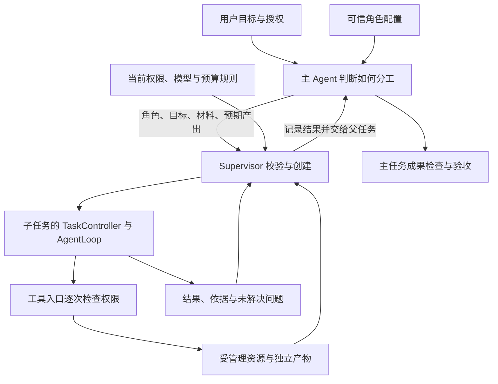

# 子 Agent 协作设计方案

> 本文件保留为历史讨论稿。确认后的通用助手设计、实际实现和当前边界，以 [2-子 Agent 协作设计说明](2-子Agent协作设计说明.md) 为准；下文的建议和待审查内容不代表尚待本轮确认。

审查稿 · 2026-09-10

本稿提出下一轮重构方案，供确认后实施。参考 Claude Code 的子 Agent 配置与委派方式，保留我们自己实现的 TaskController、AgentLoop、用户打断和成果检查。本文中的新增接口、默认行为和模块拆分均为建议，尚未实现。

本轮范围是创建、分工、上下文、模型与权限、结果交接和资源收尾。隐私实体的数据类型、构建方法和业务验收规则仍待确认；不在这里补定。千级工具与 Skill 的整体检索优化另行审视，本轮只接入子 Agent 所需的能力范围检查。

**建议采用“角色配置＋本次委派＋受控执行”的方式。**

主 Agent 根据任务决定是否分工、选择哪种助手、提供哪些材料。可信角色配置规定这类助手的用途、方法和能力上限。Supervisor 校验委派，创建执行实例，管理消息、取消和回收。用户授权由独立权限入口管理，主 Agent 和子 Agent 都不能修改它。

Claude Code 的公开文档描述了以 `description` 辅助委派、通过配置指定工具与模型、独立上下文、Skill 预加载及前后台执行等机制。我们借鉴这些职责划分；后面的权限规则、默认值和接口属于本项目方案，不宣称与 Claude Code 完全兼容，也不依据公开行为推断其内部实现。[参考：Claude Code 子 Agent 文档](https://code.claude.com/docs/en/sub-agents)

**一、角色是配置，子任务是一次运行，两者不混在一起。**

建议在应用配置目录 `config/agents/` 使用 Markdown 文件保存角色：文件头写结构化配置，正文写工作方法。目录由团队维护，不在 Agent 可修改的任务工作区中。首版只加载这个来源，不实现插件市场、多级目录覆盖或模型在线安装角色。

| 配置内容 | 作用 |
| --- | --- |
| `name`、`description`、正文 | 标识角色，说明什么时候使用，以及如何工作 |
| `tools`、`disallowedTools` | 明确允许与禁止的工具；禁止规则优先 |
| `model`、`allowedModels` | 默认模型和可选范围；支持默认继承父模型 |
| `skills`、`allowedSkills` | 区分启动时预加载的方法和执行中允许发现、加载的方法 |
| `permissionMode`、`workspaceMode` | 决定未授权操作如何处理，以及只读或独立产物的工作方式 |
| `canDelegateTo`、执行预算 | 限定可进一步委派的角色，并约束轮次、调用和执行时间 |

工具和 Skill 范围可以引用可信配置中的能力组，由程序解析成具体集合。主模型不需要列出千级工具。`tools` 缺失时拒绝启用该角色，避免无意继承全部能力；配置名称重复、模型不存在或正文格式错误时明确报告。角色正文只指导行为，不能修改权限。

建议先提供分析、执行、复核三种通用角色。分析负责调查并返回依据；执行负责在允许范围内形成独立产物；复核负责对照要求检查已有成果。这些名称不代表三个强制步骤，也不预设隐私实体业务流程。一个任务可以只使用主 Agent。

主模型常驻看到可委派角色的名称、简短用途和关键限制，选定后才加载角色正文与预加载 Skill。角色数量不等同于工具或 Skill 数量，首版不额外建设千级角色目录。

每次创建固定所用角色配置的版本。后续修改配置影响新子任务，已启动任务保留原记录；用户撤权仍立即生效，不受配置快照影响。需要停止旧配置任务时，通过取消和撤权入口处理。

**二、主 Agent 判断是否值得委派，程序判断是否允许启动。**

主 Agent 的委派指引应包括：子目标能独立说明，输入材料足够，预期结果清楚；分工能让主 Agent 继续其他工作、隔离大量中间信息，或使用适合的专门方法。简单单步操作直接调用工具。强依赖主任务实时上下文、需要不断沟通的工作优先留在主 Agent。

分工与并行分别判断。需要先生成成果再复核时，按依赖顺序执行；能够独立检查不同材料时才并行。框架不承诺自动找到最佳拆分，也不要求每次任务必须创建子 Agent。

建议把 `agent_spawn` 从仅有 `goal` 扩充为以下本次委派信息：

| 本次委派信息 | 含义 |
| --- | --- |
| 角色名称、子目标 | 使用已登记角色，说明这次要解决的问题 |
| 材料引用、必要背景 | 引用有权分配的文件或产物；必要背景可以简短说明 |
| 预期产出 | 说明父任务需要收到什么；不等于可自行改写硬性验收规则 |
| 前台或后台模式 | 立即等结果，或启动后继续其他工作；建议默认后台 |
| 可选模型、预算请求 | 只能在可信配置允许范围内选择，不能扩大上限 |
| 简短分工理由 | 用于解释本次委派的用途，不要求展示内部推理 |

父节点标识、执行编号、实际资源路径、有效权限和版本信息由运行时填写，模型不能伪造。主 Agent 可以提出额外权限需求，但不能把“已授权”作为创建参数传入。空目标、未知角色、不可访问材料、禁止模型和超限请求均在启动前拒绝，并返回可处理原因。

为防止工具重试重复创建，同一有效父执行中的同一工具调用编号只登记一个子任务；重复调用返回原引用。不同调用编号代表新请求，仍受并发和预算约束。首版不凭文字相似度自动合并任务，也不承诺跨崩溃的恰好一次执行。

**三、子 Agent 只获得本次需要的上下文，但必要约束始终由运行时注入。**

子任务的初始上下文由角色方法、本次目标与背景、获准材料引用、与本次有关的用户要求、当前有效限制及预加载 Skill 组成。用户确定的强制约束不能完全依赖父模型转述，须从运行时事实注入。普通业务要求由父模型说明，可能遗漏的风险通过材料依据和最终检查处理。

取消现在把任务级授权表、全部 Agent 结果和近期全局操作无差别注入子任务的做法。子任务只看到自己的有效能力说明、相关在途操作、自己的后代以及被明确交付的资料。模型输入中不放密钥或服务凭据。

材料通过运行时引用解析，创建时记录文件内容版本或不可变产物版本。只复制本次材料，取消购物车三个固定文件的内置复制逻辑。复制未完成或材料发生变化而无法形成一致输入时，不开始模型执行；报告初始化失败或要求重新准备。动态增加材料要经过同一检查入口并形成新委派版本。

访问检查覆盖文件读取、目录列表、历史搜索、产物读取和任务状态查询。不能只过滤提示词，却允许子任务通过历史或产物接口读回未分配内容。文件路径先规范化、校验真实目标，再做权限判断，避免路径别名绕过限制。

这是运行时管理的访问范围，不是完整的信息流隔离：父 Agent 已经读过的内容仍可能被它写进委派背景，框架不会自动识别其中所有敏感信息。对严格限定材料的场景，应优先使用材料引用和精简背景；若允许任意脚本，仍需更强执行隔离。

**四、模型、工具和权限分别决定，加载能力不会增加授权。**

建议模型选择顺序为：本次显式选择 → 角色默认模型 → 创建时父模型。每个选择都必须在任务和角色允许的模型集合内，服务已配置，接口能力与上下文预算满足任务需要。配置不满足时明确失败，不静默改用模拟模型或其他提供方。

运行后固定并展示实际模型。主 Agent 后续切换模型不自动切换已运行的子任务；下一次创建按新的父模型计算。首版不增加子任务运行中的自动模型路由或动态降级，也不根据角色名称假定便宜模型质量足够。使用不同模型的收益，需要真实任务验证。

工具与 Skill 的搜索、加载和执行都受该 Agent 的允许范围约束。常驻控制工具也需要按角色筛选，不能因为标记为 `always` 就对所有子任务开放。父 Agent 没有加载一个工具，不代表它不能委派使用该工具的工作；判断依据是允许委派的能力上限，而不是父 Agent 当前上下文中的工具列表。

每次工具执行必须同时满足系统规则、任务当前可委派授权、角色限制和本次材料及输出范围。允许嵌套时，子任务还受全部祖先可委派范围限制，不能换一个角色扩大权限。创建时保存的权限说明用于解释，真正执行时读取最新权限。角色不能覆盖系统禁止规则，Skill、模型切换、补充消息都不能改变授权。用户授权主 Agent 的单次操作也不自动授权子 Agent。

建议首版支持 `default` 与 `dontAsk` 两种审批方式：前者遇到可申请但尚未批准的操作时在主界面申请；后者直接返回未获授权的结果。任务已禁止申请时，子角色不能重新开启申请。硬性禁止的操作始终拒绝，不弹出能够绕过它的批准选项。暂不实现跳过全部权限检查的模式。只读是能力与资源限制，不用审批模式代替。

批准绑定具体 Agent、操作、资源和有效版本。界面写清谁在申请、准备做什么、授权影响范围；子任务级授权不自动扩大到兄弟或整个会话。权限不足可以由主 Agent 解释，批准仍由用户完成。取消或撤权后迟到的批准无效，在等待执行槽位或写锁后还要复核。

建议子 Agent 的两种工作方式为：

- **只读材料**：读取分配的输入，返回分析与证据；不调用模型可写文件工具。运行时仍可保存日志和结果。
- **独立产物**：读取分配的输入，在运行时分配的自身输出目录内生成成果；不能修改输入、兄弟目录或主任务最终成果。写入仍按当前授权处理，创建子任务本身不等于批准写入。

共享成果由主任务通过受控入口整理。输出目录由程序生成，文件写入和产物登记使用同一归属与权限检查，不提供绕过审批的产物写入后门。检查脚本也可能产生副作用，只有适配器能够落实其范围时才向相应角色开放；首版保留受控本地执行边界，不把工作副本宣称为安全沙箱。

**五、前台与后台复用同一执行机制，只改变父任务如何接收结果。**

Supervisor 内部启动后统一返回任务引用。后台模式立即向主 Agent 返回引用，主 Agent 继续执行；前台模式由工具等待该任务结果，等待期间不占用模型调用名额或受限的命令执行名额。

管理接口继续保留状态查询、补充消息、等待和取消。补充消息明确区分 `append` 与 `steer`：前者在子任务下一次决策前接纳；后者使该子任务旧轮次失效，清理冲突操作后以新说明继续。两者都不能增加权限。结束后的子任务首版保留只读结果，需要追加工作时创建关联的新子任务，不实现跨重启恢复原执行。

每次结果只登记一份，带稳定结果编号。前台结果通过原工具调用返回，不另投递相同的完成消息。后台结果通过父邮箱通知，查询与等待返回同一结果引用及状态，不再次创建完成事件。反复查询不能重复启动主循环；进程内去重不等于持久消息事务。

结果记录包含完成情况、简短结论、输入与要求版本、产物或证据引用、未解决问题以及清理情况。运行时填写执行事实，模型填写结论和问题；格式正确不代表内容正确。无业务检查标准时，子任务结果仍标为待核实资料，交给主 Agent，不强制用户逐个验收子任务。最终任务沿用已有成果检查和用户验收机制。

父任务处理必要后台结果后才能最终完成。子任务失败默认作为结果交给父任务，不自动取消无关兄弟。复核 Agent 也是模型，它的意见不直接等于成果检查通过；相互矛盾的结论由主 Agent 对照证据处理，无法判断时保留分歧。

**六、创建和取消必须经过同一个管理入口，结束必须包含资源收尾。**

启动采用“检查 → 登记归属并预留名额 → 准备输入 → 启动执行”的顺序。准备输入可以异步进行，但登记和标记关闭之间的状态变更必须顺序处理。启动失败统一记录失败、清理已分配资源、释放可释放的名额并返回结果，不能留下永久 `idle` 节点。

关闭某个分支时，先标记该分支不再接受新任务和新操作，再传播取消并等待资源收尾。每次创建还要检查全部祖先分支是否开放；登记后尚未获得执行句柄的工作也要响应取消，句柄产生后立即接管清理。重复取消返回同一关闭过程，不重复通知结果。

建议将工作结果与清理状态分别保存。工作可以成功、失败、取消或待核实；资源则可能尚在清理、已清理或无法确认。对外“已结束”需要执行驱动和受管资源都已收尾。清理无法确认时保留资源记录、报告原因，阻止依赖其释放的冲突操作和全任务完成，不能吞掉异常后返回 `cancelled: true`。

主命令退出不等于进程组已经退出。修复现有 `close` 事件到来即删除资源记录的逻辑，对受管进程组检查并清理仍存活的后代；请求停止、必要时强制终止和确认回收分别记录。资源编号和进程归属从启动起跟踪，服务重启后不根据历史 PID 直接发送信号，避免误伤复用 PID。

数量限制改为区分存活子任务、模型请求并发、执行进程并发及累计调用预算。初始化、排队和清理中的任务仍占用相应的存活名额，历史完成节点不永久占用它。名额检查与预留必须在同一个受控步骤中完成。单任务预算与全局预算同时生效，重新委派不能重置任务总预算。

建议默认不允许子 Agent 再创建子 Agent；只有配置 `canDelegateTo` 后才开放对应角色，并继续受深度和总预算限制。创建工具在模型侧隐藏、执行侧仍校验。这样保留任务树能力，但普通演示优先呈现主 Agent 管理一层子任务。

对于用户干预，建议明确以下行为：

| 用户操作 | 子任务行为 |
| --- | --- |
| 追加普通说明 | 主任务在下一步接纳，由主 Agent 判断是否向相关子任务补充；不自动取消全部后台工作 |
| 明确撤权或收紧可执行范围 | 运行时立即更新有效权限，阻止后续越权操作，并取消能够取消的冲突操作 |
| 主任务立即改方向 | 首版建议取消旧目标下仍在运行的子任务，保留已发生事实，再按新目标重新委派 |
| 停止整个任务 | 关闭派生入口，取消全树并确认清理；不能确认的资源单独展示 |

“改方向时取消旧子任务”是对原设计中“保留仍有效后台工作”的保守调整，目的是先做出明确、可测的行为。自动判断哪些旧子任务仍然适用暂不实现，需审查确认。已结束结果和追加说明前的结果可能基于旧要求，继续保留版本标记，由主任务重新核实。普通自然语言不是权限记录，现有少量只读关键词也不应宣传为通用权限意图识别。

服务正常退出走同一关闭路径；浏览器断开不取消任务。后端强杀、主机故障、任意进程主动逃逸和远端不可取消副作用仍在当前保证之外。设置预算可以停止后续派发，但不能强迫不响应取消的任意远端操作立即退出，必须保留未确认状态。

**七、代码按职责拆分，保留已经完成的核心。**

| 部分 | 建议职责及修改范围 |
| --- | --- |
| AgentDefinitionRegistry | 新增 TS 模块，读取和校验角色配置，提供可见摘要与版本快照 |
| Supervisor | 新增 TS 模块，统一任务树、启动、关闭、名额和结果投递；不承担模型分工推理 |
| AgentScope / Policy | 以类型化数据和检查接口表达材料、工具、模型及授权边界，供所有访问入口复用 |
| 资源管理模块 | 提取并修复 ProcessManager，管理进程与清理结果，向 Supervisor 提供可信状态 |
| TaskController / AgentLoop | 保留单 Agent 执行与成果检查，接入分支状态和收尾接口；不复制第二套循环 |
| ContextManager 与工具入口 | 按 Agent 范围组装上下文、检索、加载、执行与读取结果；不自行修改任务树 |
| 场景适配与 Harness | 场景准备输入和检查规则；Harness 负责组装与对外 API，逐步移出分工、授权和生命周期细节 |

Supervisor 通过接口调用控制器和资源模块，不直接依赖 UI、购物车文件或某个模型 SDK。TaskController 仍是单 Agent 控制字段的唯一写入者；Supervisor 写任务归属、分支开放状态和资源收尾记录。收尾分为控制器报告执行结束、Supervisor 确认资源释放、对外发布最终状态，避免双方独立宣布完成。执行结束回调不能等待自身驱动释放，Supervisor 和控制器也不能互相等待对方的结束 Promise。

本轮不整体重写模型、工具目录和上下文压缩。原始全量事件保留给任务级审计，模型侧通过范围过滤读取；模型切换和压缩也使用同一上下文范围，不能重新注入全任务资料。不能为了隔离子 Agent 而删除原始证据。角色、工具和预加载 Skill 的实际使用版本须可追溯，执行安全规则始终读取当前值。

| 当前实现或旧方案 | 本稿建议替换为 |
| --- | --- |
| `agent_spawn(goal)` | 选择可信角色，提交目标、材料、预期产出及运行模式 |
| 所有子任务使用近似相同配置 | 按角色配置方法、模型和能力，按本次委派缩小资源范围 |
| 全任务事实和历史对所有子任务开放 | 必要约束注入＋明确材料分配＋各读取入口检查范围 |
| 子任务统一禁止文件写入 | 只读或独立产物两种方式，写入继续受授权约束 |
| 固定复制购物车三个文件 | 场景提供可验证的输入材料准备方式 |
| 累计节点数等于 Agent 数量限制 | 存活任务名额、执行并发和累计预算分别管理 |
| 一般子任务也可继续派生 | 默认关闭嵌套，由角色显式允许并设置上限 |
| 改方向时保留仍有效子任务 | 首版取消旧运行子任务，保留证据并重新委派 |
| 分散处理失败、取消和返回结果 | Supervisor 统一收尾与投递，控制器继续维护唯一有效循环 |

旧模拟脚本要迁移到新角色与委派接口，继续标明“预设模型”。真实模型能否合理选角色和提供足够材料另做评估，不把模拟脚本成功当成模型自主分工的证据。旧的成果检查与消息防丢失回归仍需通过，修改测试只能对应已确认的行为变化。

前端沿用简洁的任务卡片：默认展示子目标、状态和实际模型，展开查看角色、输入依据、有效范围、结果和异常。授权仍集中在主界面，新增“前台等待、后台执行、待核实、清理未确认”等必要区别；本轮不重新设计整套界面。

**八、用确定性测试验证边界，用真实模型验证委派质量。**

建议先写以下失败用例，再接入新模块：

- 创建请求只有合法字段才能启动；越权材料、禁止模型和角色配置错误不会创建活动执行。重复调用编号不会派生第二个子任务。
- 子任务只看到被分配的材料和有效权限；从文件、产物、历史和状态入口读取未分配内容都会被拒绝。工具未展示时，直接构造调用也不能绕过限制。
- 撤权、排队、写锁与取消交错时，旧授权不能继续生效。加载 Skill、修改普通消息或切换模型不能扩大权限。
- 前台等待释放执行名额；后台创建后主 Agent 可以继续工作。后台结果、查询和等待交错时不重复投递或启动主循环。
- 初始化失败有明确结果；分支开始关闭后不能再派生；主命令先退出而同组后代存活时不能提前报告已回收；清理未确认会阻止全任务完成。
- 一个子任务失败不拖垮无关兄弟；要求或材料变化后旧结果带有版本提示；待核实子结果不会被直接认定为主任务验收通过。
- 存活名额被原子预留，结束后正确释放；嵌套和重新委派不能绕过全任务预算；重复取消不重复清理或通知。

真实模型验证选择几个有代表性的任务：简单任务、可独立分工的任务、必须顺序处理的任务，以及执行途中修改要求的任务。查看分工是否合理、委派信息是否足够、主任务是否使用了子结果，并记录整体耗时、模型用量和成果检查情况。不以固定创建次数作为成功标准，也不预设多 Agent 一定更快或更准确。

实施建议分为三个连续步骤：先落实角色配置、委派输入与权限边界；再接入 Supervisor 并修复收尾缺陷；最后迁移演示、验证真实模型并同步实际功能说明。不能只交付角色文件和新工具参数，就宣称这一轮多 Agent 机制已经完成。

本稿需要重点审查的取舍是：默认角色采用明确能力范围、普通子任务默认不继续派生、允许受控独立产物、改方向时先取消旧子任务，以及首版只从可信配置加载角色。确认这些行为后，再更新原设计的冲突条目和运行代码。
